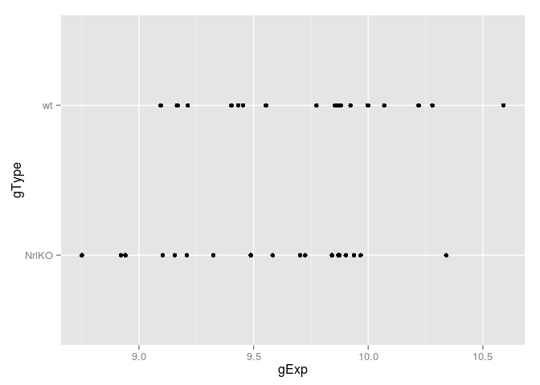
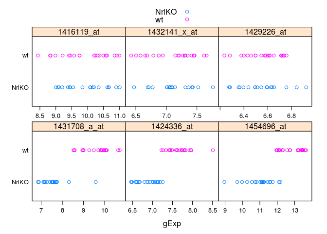

Two group comparisons and data aggregation
======================================================================

Contributors: Jenny Bryan, W. Evan Durno


We have goals on three different fronts today:

  * __Workstyle: reproducible research.__ Instead of typing in the Console, try keeping R code in a script, running it from there interactively, sourcing it as a whole, and/or making a nice HTML report from it. Accomplished easily via RStudio's "File --> Compile Notebook" command; requires the `knitr` add-on package.
  * __Statistical inference: two group comparisons.__ We will conduct various statistical tests for assessing whether two populations (or treatments or conditions or whatever) differ in distribution or in central location. Today, we're still doing this one gene at a time or for a small-ish number of genes (mass production of such tests comes later).
  * __Workflow: data aggregation.__ We often need to do a repetitive computational (or graphical task) for various subsets of an R object, especially data.frames and matrices. This is called "data aggregation" and R has fantastic facilities for this that will eliminate the need for most top-level, user-written `for()` loops. Learn to love the `apply` family of functions and/or the add-on package `plyr` or `dplyr` (in seminar04b).
  
## Reproducible research

*Note: This overlaps partially with previously borrowed STAT 545 content: [R basics, workspace and working directory, RStudio projects](https://stat545-ubc.github.io/block002_hello-r-workspace-wd-project.html). You may want to skim of skip section.*

When you are new to R, it is OK to perform your computations live in the Console, to allow your workspace to be saved / loaded repeatedly, and to mine your R history for "good" commands. But before long, I suggest you up your game and start to work in a way that guarantees you will be able to reproduce your analytical results and your figures. Keep your R commands in scripts, which shall have names ending in ".r" or ".R" by convention. Rest assured, you can execute the code easily in RStudio (or other IDEs) without literally copying from the script and pasting into the Console.

Two main approaches (you will likely end up using a hybrid):

  * Work interactively in the Console for a while. Once you've got some analysis worth preserving, go to the History tab in the upper right pane. Select the commands you need to keep and use the "To Source" button to create a new R script. In the upper left pane, you will now have an R script in an editor pane, probably called "Untitled1". Save with a descriptive name, e.g. "deaByGtype.R", for "differential expression analysis by genotype", remembering to use the ".r" or ".R" suffix. Assuming you're working in an RStudio project and you haven't done anything funny with your working directory, the script will be saved, logically, in the associated directory.
  * Create a new R script with "File --> New --> R script". Write your R commands in the script, in the editor pane, and send the commands to the Console with the mouse (explore the various "Run" options in the editor's upper right corner) or, *much better in the long run*, keyboard shortcuts. Once you've done a little work, save and name the script as described above.
  
Once your script exists, you can continue to do some work in the Console if you wish, select those commands in the History and use the "To Source" button to move them into the script. That is, the approaches above are both useful and are not mutually exclusive.

Once your script contains a coherent, complete analysis, you can create an easy low-tech report, containing your source code, and it's outputs. I urge you to always load data with commands, not the mouse, and to write files, including figures, with commands not the mouse.

> If you have not already installed `knitr`, you will need to do so now. Recall that can be done with `install.packages()`, among other ways.

With focus in the editor pane holding your script, use RStudio's "File --> Compile Notebook" command. Accept the default name and location, at least for today. A preview of the html "notebook" you've just created should pop up. You can also use RStudio's Files pane (or any other method) to verify that, e.g., "deaByGtype.html" now exists. Go visit the file in your browser and enjoy the warm, fuzzy feeling of having a complete automated analysis report. Read more about RStudio's notebooks [here](http://www.rstudio.com/ide/docs/authoring/markdown_notebooks).

*Note: we have already had some discussion of R Markdown in last week's seminar.*

For richer reports, you will eventually want to write in R markdown or LaTeX, instead of of just plain R code. These other formats allow for a mix of prose (including hyperlinks or mathematical notation), code, and the outputs of code, such as nicely formatted tables and figures. These seminar pages, for example, are authored in R markdown. Your early experimentation with "File-->Compile Notebook" puts you on a path to take advantage of a very powerful set of tools for reproducible research.  Read more about writing R Markdown within RStudio [here](http://www.rstudio.com/ide/docs/authoring/using_markdown). Read more about the `knitr` package which is powering this [here](http://yihui.name/knitr/).

I encourage you to start experimenting with keeping code in a script and generating R-based reports programmatically in today's seminar.

## Load the `photoRec` data and some packages

> Remember you may need to edit the file paths below, to reflect your working directory and local file storage choices.


```r
library(lattice)
library(ggplot2)
library(plyr)
```

```r
prDat <- read.table("../examples/photoRec/data/GSE4051_data.tsv")
```


```r
str(prDat, max.level = 0)
```

```
## 'data.frame':	29949 obs. of  39 variables:
```


```r
prDes <- readRDS("../examples/photoRec/data/GSE4051_design.rds")
```

```r
str(prDes)
```

```
## 'data.frame':	39 obs. of  4 variables:
##  $ sidChar : Factor w/ 39 levels "Sample_1","Sample_10",..: 13 14 15 16 8 9 36 17 18 19 ...
##  $ sidNum  : int  20 21 22 23 16 17 6 24 25 26 ...
##  $ devStage: Factor w/ 5 levels "4_weeks","E16",..: 2 2 2 2 2 2 2 4 4 4 ...
##  $ gType   : Factor w/ 2 levels "NrlKO","wt": 2 2 2 2 1 1 1 2 2 2 ...
```

## Two sample tests -- one gene

Let's extract the data for one gene and put in a data.frame with the experimental information.

```r
set.seed(987)
(theGene <- sample(1:nrow(prDat), 1))
```

```
## [1] 14294
```

```r
pDat <- data.frame(prDes, gExp = unlist(prDat[theGene, ]))
str(pDat)
```

```
## 'data.frame':	39 obs. of  5 variables:
##  $ sidChar : Factor w/ 39 levels "Sample_1","Sample_10",..: 13 14 15 16 8 9 36 17 18 19 ...
##  $ sidNum  : int  20 21 22 23 16 17 6 24 25 26 ...
##  $ devStage: Factor w/ 5 levels "4_weeks","E16",..: 2 2 2 2 2 2 2 4 4 4 ...
##  $ gType   : Factor w/ 2 levels "NrlKO","wt": 2 2 2 2 1 1 1 2 2 2 ...
##  $ gExp    : num  9.88 10.59 10.28 10.22 8.75 ...
```

Always explore the data before plunging into analysis! What are the sample means in the wild type and Nrl knockout groups (yes, we're ignoring developmental stage today)? (`aggregate()` and other data aggregation functions are explained below.)


```r
aggregate(gExp ~ gType, pDat, FUN = mean)
```

```
##   gType     gExp
## 1 NrlKO 9.553105
## 2    wt 9.758200
```

Doing the same with a `plyr` function:


```r
ddply(pDat, ~ gType, summarize, gExp = mean(gExp))
```

```
##   gType     gExp
## 1 NrlKO 9.553105
## 2    wt 9.758200
```

Let's make a stripplot so we can sanity test our $t$ test result. Using `lattice`:


```r
stripplot(gType ~ gExp, pDat)
```

 

And again with `ggplot2`:


```r
ggplot(pDat, aes(x = gExp, y = gType)) + geom_point()
```

 

We will do a two-sample $t$ test comparing wild type to the Nrl knockouts.


```r
t.test(gExp ~ gType, pDat)
```

```
## 
## 	Welch Two Sample t-test
## 
## data:  gExp by gType
## t = -1.4794, df = 36.781, p-value = 0.1475
## alternative hypothesis: true difference in means is not equal to 0
## 95 percent confidence interval:
##  -0.48605065  0.07586118
## sample estimates:
## mean in group NrlKO    mean in group wt 
##            9.553105            9.758200
```

If we save the $t$ test result, we can inspect what it is.


```r
ttRes <- t.test(gExp ~ gType, pDat)
str(ttRes)
```

```
## List of 9
##  $ statistic  : Named num -1.48
##   ..- attr(*, "names")= chr "t"
##  $ parameter  : Named num 36.8
##   ..- attr(*, "names")= chr "df"
##  $ p.value    : num 0.148
##  $ conf.int   : atomic [1:2] -0.4861 0.0759
##   ..- attr(*, "conf.level")= num 0.95
##  $ estimate   : Named num [1:2] 9.55 9.76
##   ..- attr(*, "names")= chr [1:2] "mean in group NrlKO" "mean in group wt"
##  $ null.value : Named num 0
##   ..- attr(*, "names")= chr "difference in means"
##  $ alternative: chr "two.sided"
##  $ method     : chr "Welch Two Sample t-test"
##  $ data.name  : chr "gExp by gType"
##  - attr(*, "class")= chr "htest"
```
It is a `list`; some of the more interesting and useful components are the test statistic and p-value. Recall how to extract components of a list:

```r
ttRes$statistic
```

```
##         t 
## -1.479396
```

```r
ttRes$p.value
```

```
## [1] 0.1475491
```

You try: draw a different gene at random or pick one for biological interest and look up the Affy probe ID. Use the $t$ test, with and without the common variance assumption, the Wilcoxon, and/or the Kolmogorov-Smirnov test to assess differential expression. Can you pull test statistics and/or p-values from the different approaches into an common object, like a readable table? Are you getting the same message from the various approaches? Hint: `wilcox.test()`, `ks.test()`.

## What is data aggregation?

Warning: it is impossible to cover data aggregation without confronting the different flavors of R objects, e.g. vectors vs. matrices vs. data.frames vs. lists. Expect to encounter technical details about the R language. You do not need to master all of this today (or, perhaps, ever), so get what you can out of it and revisit later if needed.

Please read some content from STAT 545A (all drawn from [Data aggregation](http://www.stat.ubc.ca/~jenny/STAT545A/block04_dataAggregation.html)). Specific content for now:

  * [Data aggregation overview](http://www.stat.ubc.ca/~jenny/STAT545A/block04_dataAggregation.html#data-aggregation-1)
  * [Data aggregation landscape](http://www.stat.ubc.ca/~jenny/STAT545A/block04_dataAggregation.html#data-aggregation-landscape)
  * [Slides on data aggregation](http://www.slideshare.net/jenniferbryan5811/cm009-data-aggregation)
  
## `apply()` for computing on rows and columns of matrices

Even though data.frames are at the heart of most analyses, let's start at the beginning with `apply()`, which operates on a matrix (or arrays more generally). `apply()` is a built-in base R function; it is not part of `plyr`. Recall that arrays can only hold info all of the same "flavor", such as numeric.

We can get a numeric matrix easily from the gene expression variables in the small excerpt of `photoRec` that we've worked with before.


```r
kDat <- readRDS("../examples/photoRec/data/GSE4051_MINI.rds")
```


```r
kMat <- as.matrix(kDat[c('crabHammer', 'eggBomb', 'poisonFang')])
str(kMat)
```

```
##  num [1:39, 1:3] 10.22 10.02 9.64 9.65 8.58 ...
##  - attr(*, "dimnames")=List of 2
##   ..$ : NULL
##   ..$ : chr [1:3] "crabHammer" "eggBomb" "poisonFang"
```

Let's compute the median expression for specific genes (= *column*), "by hand" and using `apply()`.

```r
median(kMat[ , 1])         # column numbers are mysterious
```

```
## [1] 9.611
```

```r
median(kMat[ , 'eggBomb']) # use names for better code!
```

```
## [1] 6.757
```

```r
apply(kMat, 2, median)
```

```
## crabHammer    eggBomb poisonFang 
##      9.611      6.757      7.350
```

```r
## apply usage: apply(X, MARGIN, FUN, ...)
```

The first argument of `apply()` is the matrix, the second is the dimension(s) to operate on (`1` means rows, `2` means columns, and so on), the third is the function to apply, which can be built-in like `median()` above, custom defined by you elsewhere, or custom defined by you "on the fly". [Reading the help file](http://stat.ethz.ch/R-manual/R-devel/library/base/html/apply.html), you will also notice the weird `...` argument where you can specify arbitrary arguments that will be passed through to the function specified via `FUN =`. Here's a alternative way to compute gene-specific medians (or other quantiles) using this argument.


```r
apply(kMat, 2, quantile, probs = 0.5)
```

```
## crabHammer    eggBomb poisonFang 
##      9.611      6.757      7.350
```

```r
apply(kMat, 2, quantile, probs = c(0.25, 0.75))
```

```
##     crabHammer eggBomb poisonFang
## 25%      8.938  6.2780     7.1885
## 75%      9.830  7.0945     7.4765
```

Let's take the minimum gene expression for each sample, across these three genes. Then let's determine *which gene* contributed that minimum value.


```r
apply(kMat, 1, min)
```

```
##  [1] 7.370 6.890 6.720 6.529 6.470 7.005 6.735 6.587 6.170 6.870 6.800
## [12] 6.138 6.166 6.269 6.264 6.530 7.100 6.269 6.211 6.286 6.347 6.270
## [23] 6.188 7.005 7.082 6.757 6.155 7.228 7.226 7.363 7.081 6.993 6.992
## [34] 6.608 7.003 6.981 7.165 7.075 6.558
```

```r
colnames(kMat)[apply(kMat, 1, which.min)]
```

```
##  [1] "poisonFang" "eggBomb"    "eggBomb"    "eggBomb"    "eggBomb"   
##  [6] "poisonFang" "poisonFang" "eggBomb"    "eggBomb"    "eggBomb"   
## [11] "eggBomb"    "eggBomb"    "eggBomb"    "eggBomb"    "eggBomb"   
## [16] "eggBomb"    "poisonFang" "eggBomb"    "eggBomb"    "eggBomb"   
## [21] "eggBomb"    "eggBomb"    "eggBomb"    "poisonFang" "eggBomb"   
## [26] "eggBomb"    "eggBomb"    "eggBomb"    "eggBomb"    "poisonFang"
## [31] "eggBomb"    "poisonFang" "eggBomb"    "eggBomb"    "eggBomb"   
## [36] "poisonFang" "eggBomb"    "poisonFang" "eggBomb"
```

Computing row- and column-wise sums and means is such an important special case that there are purpose-built and fast functions for this that I recommend you use when relevant.


```r
rowSums(kMat) #see also rowMeans, colMeans, colSums
```

```
##  [1] 25.052 24.087 23.712 23.221 22.547 24.210 24.092 22.964 22.657 23.992
## [11] 23.256 22.960 22.780 22.599 23.396 22.172 24.804 22.494 22.313 22.584
## [21] 23.143 22.604 22.745 25.428 24.172 23.860 21.805 24.525 24.758 24.941
## [31] 24.438 24.819 23.983 23.704 24.523 23.862 23.644 23.926 23.423
```

```r
all.equal(rowSums(kMat), apply(kMat, 1, sum))
```

```
## [1] TRUE
```

```r
colMeans(kMat)
```

```
## crabHammer    eggBomb poisonFang 
##   9.427821   6.788077   7.378846
```

```r
all.equal(colMeans(kMat), apply(kMat, 2, mean))
```

```
## [1] TRUE
```

Obviously you won't notice the performance advantage in `kMat` but we can detect it with the entire dataset `prDat`, where we get a substantial speed-up (albeit of little practical significance.) For a dorky little timing study, see the appendix. __More important than the superiority of `rowMeans()` over `apply(..., 1, mean)` is the superiority of *either* over a top-level `for()` loop__. Compare these two elegant little statements, short and self-documenting:

```r
jRowSums <- rowSums(prDat)
jRowSums <- apply(prDat, 1, sum)
```
to this hot mess:

```r
prMat <- as.matrix(prDat) # must have an actual matrix
jRowSums <- rep(NA, nrow(prDat)) # must initialize a receptacle
for(i in 1:nrow(prDat)) {
   jRowSums[i] <- sum(prMat[i, ])
}
```
Yeah, yeah, performance advantage is there but the __real reason__ to use `apply()` functions is that your code is easier to write and easier to read. You also don't have to set up a "storage receptacle" ahead of time, which becomes really nice when you are less certain exactly what sort of output is coming back at you (more later).

Due to historical problems with lousy memory management, there is a special horror around `for()` loops in R, although they can be useful. To be clear, of course computations like row-wise means require a `for` loop to happen somewhere. When you use the `apply()` family functions this loop is often happening down at a very low level (i.e. down in C, which is what R is written in) and implemented in code written by a better programmer than you or I. And therefore you use less RAM and time, sometimes dramatically less. __But the real reason to embrace data aggregation facilities is the huge improvement in code readability and writability.__

## Computing on groups of observations with `aggregate()`

More typical -- and conceptually trickier -- than the row- and column-wise operations above are operations on groups of observations, where the groups are induced by the levels of some factor (or combinations of multiple factors). We re-focus on data.frames, which is our go-to data receptacle.

Let's compute on a quantitative variable, based on the levels of a factor using the built-in function `aggregate()`. Specifically, let's compute average expression of `eggBomb` for different levels of `devStage`.


```r
aggregate(eggBomb ~ devStage, kDat, FUN = mean)
```

```
##   devStage  eggBomb
## 1  4_weeks 7.062875
## 2      E16 6.879000
## 3      P10 7.142500
## 4       P2 6.408000
## 5       P6 6.459375
```

The call has familiar elements: a formula `y ~ x` reminiscent of other modelling and graphing calls, a data.frame where the variables are, and a function to apply. [Read the documentation](http://stat.ethz.ch/R-manual/R-devel/library/stats/html/aggregate.html) to learn more.

We can split the data into groups based on a *combination* of factors.


```r
aggregate(eggBomb ~ gType * devStage, kDat, FUN = mean)
```

```
##    gType devStage  eggBomb
## 1  NrlKO  4_weeks 7.008500
## 2     wt  4_weeks 7.117250
## 3  NrlKO      E16 6.850667
## 4     wt      E16 6.900250
## 5  NrlKO      P10 7.243250
## 6     wt      P10 7.041750
## 7  NrlKO       P2 6.209250
## 8     wt       P2 6.606750
## 9  NrlKO       P6 6.272750
## 10    wt       P6 6.646000
```

We are not limited to computing a single value for each group. Although it's silly with such a small dataset, we can use `range()` to report the min and max.


```r
aggregate(eggBomb ~ gType * devStage, kDat, FUN = range)
```

```
##    gType devStage eggBomb.1 eggBomb.2
## 1  NrlKO  4_weeks     6.558     7.204
## 2     wt  4_weeks     6.608     7.866
## 3  NrlKO      E16     6.470     7.065
## 4     wt      E16     6.529     7.462
## 5  NrlKO      P10     7.081     7.438
## 6     wt      P10     6.155     8.173
## 7  NrlKO       P2     6.138     6.269
## 8     wt       P2     6.170     6.870
## 9  NrlKO       P6     6.188     6.347
## 10    wt       P6     6.211     7.574
```

Revisiting those tasks with `plyr`:


```r
ddply(kDat, ~ devStage, summarize, avg = mean(eggBomb))
```

```
##   devStage      avg
## 1  4_weeks 7.062875
## 2      E16 6.879000
## 3      P10 7.142500
## 4       P2 6.408000
## 5       P6 6.459375
```

```r
ddply(kDat, ~ gType * devStage, summarize, avg = mean(eggBomb))
```

```
##    gType devStage      avg
## 1  NrlKO  4_weeks 7.008500
## 2  NrlKO      E16 6.850667
## 3  NrlKO      P10 7.243250
## 4  NrlKO       P2 6.209250
## 5  NrlKO       P6 6.272750
## 6     wt  4_weeks 7.117250
## 7     wt      E16 6.900250
## 8     wt      P10 7.041750
## 9     wt       P2 6.606750
## 10    wt       P6 6.646000
```

```r
ddply(kDat, ~ gType * devStage, summarize,
      min = min(eggBomb), max = max(eggBomb))
```

```
##    gType devStage   min   max
## 1  NrlKO  4_weeks 6.558 7.204
## 2  NrlKO      E16 6.470 7.065
## 3  NrlKO      P10 7.081 7.438
## 4  NrlKO       P2 6.138 6.269
## 5  NrlKO       P6 6.188 6.347
## 6     wt  4_weeks 6.608 7.866
## 7     wt      E16 6.529 7.462
## 8     wt      P10 6.155 8.173
## 9     wt       P2 6.170 6.870
## 10    wt       P6 6.211 7.574
```
Note that `aggregate()` and `plyr` functions seem to differ in their convention about which categorical variable gets incremented first or fastest.

## Two sample tests -- a handful of genes

Let's grab the data from 6 genes. I've picked them for you: 3 are interesting ('hits'), 3 are not. I also reshape the data to be tall and skinny, which is generally a good policy and allows us to keep learning more about data aggregation.


```r
keepGenes <- c("1431708_a_at", "1424336_at", "1454696_at",
               "1416119_at", "1432141_x_at", "1429226_at" )
miniDat <- subset(prDat, rownames(prDat) %in% keepGenes)
miniDat <- data.frame(gExp = as.vector(t(as.matrix(miniDat))),
                      gene = factor(rep(rownames(miniDat), each = ncol(miniDat)),
                                    levels = keepGenes))
miniDat <- suppressWarnings(data.frame(prDes, miniDat))
str(miniDat)
```

```
## 'data.frame':	234 obs. of  6 variables:
##  $ sidChar : Factor w/ 39 levels "Sample_1","Sample_10",..: 13 14 15 16 8 9 36 17 18 19 ...
##  $ sidNum  : int  20 21 22 23 16 17 6 24 25 26 ...
##  $ devStage: Factor w/ 5 levels "4_weeks","E16",..: 2 2 2 2 2 2 2 4 4 4 ...
##  $ gType   : Factor w/ 2 levels "NrlKO","wt": 2 2 2 2 1 1 1 2 2 2 ...
##  $ gExp    : num  10.6 11 10.8 10.9 9.2 ...
##  $ gene    : Factor w/ 6 levels "1431708_a_at",..: 4 4 4 4 4 4 4 4 4 4 ...
```

Let's plot to make sure we have successfully gotten 3 clear 'hits' and 3 clear boring genes, as promised. First with `lattice`:


```r
stripplot(gType ~ gExp | gene, miniDat,
          scales = list(x = list(relation = "free")),
          group = gType, auto.key = TRUE)
```

 
Smells "right": bottom row consists of 3 'hits', top row holds the boring genes.

Making same plot with `ggplot2`:


```r
ggplot(miniDat, aes(x = gExp, y = gType, color = gType)) +
  facet_wrap(~ gene, scales="free_x") +
  geom_point(alpha = 0.7) +
  theme(panel.grid.major.x = element_blank())
```

 

Let's use data aggregation techniques to conduct some two group comparisons for each of these 6 genes. Recall the syntax of the two-sample t-test for one gene:


```r
t.test(gExp ~ gType, someDat)
```

Conceptually, we want to make a sub-data.frame for each gene and provide in the place of `someDat` in a $t$ test call like above. Sometimes that is a useful first step, when building up a data aggregation task. Walk before you run.

```r
someDat <- droplevels(subset(miniDat, gene == keepGenes[1]))
t.test(gExp ~ gType, someDat)
```

```
## 
## 	Welch Two Sample t-test
## 
## data:  gExp by gType
## t = -9.838, df = 36.89, p-value = 7.381e-12
## alternative hypothesis: true difference in means is not equal to 0
## 95 percent confidence interval:
##  -2.383870 -1.569556
## sample estimates:
## mean in group NrlKO    mean in group wt 
##            7.577737            9.554450
```

How do we scale this up to all 6 genes? We have now outgrown the capability of `aggregate()`. If we restrict ourselves to the built-in functions, we'd need to look at functions like `tapply()`, `split()`, and `by()`. However I think it's the right time to start using `plyr`.

## The `plyr` package

Please read some content from STAT 545A (all drawn from [Data aggregation](http://www.stat.ubc.ca/~jenny/STAT545A/block04_dataAggregation.html)). Specific sub-sections:

  * [Install and load `plyr`](http://www.stat.ubc.ca/~jenny/STAT545A/block04_dataAggregation.html#install-and-load-plyr)
  * [`plyr` Big Ideas](http://www.stat.ubc.ca/~jenny/STAT545A/block04_dataAggregation.html#plyr-big-ideas)
  * [Computing in groups with plyr](http://stat545-ubc.github.io/block013_plyr-ddply.html)
  
Do this if you don't have `plyr` yet:

```r
install.packages(pkgs = "plyr")
```

Since our input, `miniDat`, is a data.frame, we will use functions that start with `d`. What do we want to get back, if anything? If we are happy to watch the $t$ test results fly by on the screen, we can use `d_ply()`:


```r
library(plyr)
d_ply(miniDat, ~ gene, function(x) t.test(gExp ~ gType, x), .print = TRUE)
```

```
## 
## 	Welch Two Sample t-test
## 
## data:  gExp by gType
## t = -9.838, df = 36.89, p-value = 7.381e-12
## alternative hypothesis: true difference in means is not equal to 0
## 95 percent confidence interval:
##  -2.383870 -1.569556
## sample estimates:
## mean in group NrlKO    mean in group wt 
##            7.577737            9.554450 
## 
## 
## 	Welch Two Sample t-test
## 
## data:  gExp by gType
## t = -9.0607, df = 36.489, p-value = 7.146e-11
## alternative hypothesis: true difference in means is not equal to 0
## 95 percent confidence interval:
##  -0.9834769 -0.6238652
## sample estimates:
## mean in group NrlKO    mean in group wt 
##            6.866579            7.670250 
## 
## 
## 	Welch Two Sample t-test
## 
## data:  gExp by gType
## t = -8.0771, df = 33.493, p-value = 2.278e-09
## alternative hypothesis: true difference in means is not equal to 0
## 95 percent confidence interval:
##  -2.345872 -1.402286
## sample estimates:
## mean in group NrlKO    mean in group wt 
##            10.97442            12.84850 
## 
## 
## 	Welch Two Sample t-test
## 
## data:  gExp by gType
## t = 0.184, df = 36.534, p-value = 0.8551
## alternative hypothesis: true difference in means is not equal to 0
## 95 percent confidence interval:
##  -0.4233967  0.5079125
## sample estimates:
## mean in group NrlKO    mean in group wt 
##            9.935158            9.892900 
## 
## 
## 	Welch Two Sample t-test
## 
## data:  gExp by gType
## t = 0.1324, df = 36.313, p-value = 0.8954
## alternative hypothesis: true difference in means is not equal to 0
## 95 percent confidence interval:
##  -0.2117529  0.2413424
## sample estimates:
## mean in group NrlKO    mean in group wt 
##            7.106895            7.092100 
## 
## 
## 	Welch Two Sample t-test
## 
## data:  gExp by gType
## t = -0.0983, df = 35.578, p-value = 0.9223
## alternative hypothesis: true difference in means is not equal to 0
## 95 percent confidence interval:
##  -0.1122804  0.1019067
## sample estimates:
## mean in group NrlKO    mean in group wt 
##            6.546263            6.551450
```

That's not so helpful: the results aren't labelled by probeset and whiz by. In real life, you will want these results for further processing, e.g. writing to file or presenting in a table. We know that `t.test()` returns a list, so we can use `dlply()` to retain everything in a new list with one component per probeset:


```r
ttRes <- dlply(miniDat, ~ gene, function(x) t.test(gExp ~ gType, x))
names(ttRes)
```

```
## [1] "1431708_a_at" "1424336_at"   "1454696_at"   "1416119_at"  
## [5] "1432141_x_at" "1429226_at"
```

```r
ttRes[["1454696_at"]]
```

```
## 
## 	Welch Two Sample t-test
## 
## data:  gExp by gType
## t = -8.0771, df = 33.493, p-value = 2.278e-09
## alternative hypothesis: true difference in means is not equal to 0
## 95 percent confidence interval:
##  -2.345872 -1.402286
## sample estimates:
## mean in group NrlKO    mean in group wt 
##            10.97442            12.84850
```

We could then process this list further with `plyr` functions that start with `l`. If we knew in advance that we only wanted, say, the test statistic and the p-value, here's how we go after that directly via `ddply()`:


```r
ttRes <- ddply(miniDat, ~ gene, function(z) {
  zz <- t.test(gExp ~ gType, z)
  round(c(tStat = zz$statistic, pVal = zz$p.value), 4)
})
ttRes
```

```
##           gene tStat.t   pVal
## 1 1431708_a_at -9.8380 0.0000
## 2   1424336_at -9.0607 0.0000
## 3   1454696_at -8.0771 0.0000
## 4   1416119_at  0.1840 0.8551
## 5 1432141_x_at  0.1324 0.8954
## 6   1429226_at -0.0983 0.9223
```

We've now conducted two group comparisons for all 6 genes at once without ever writing a top-level `for` loop. Use data aggregation functions! Long-term, I strongly recommend use of `plyr` over the built-in `apply()` functions, due to its logical and very general framework.

## Home work

Select 50 random rows from the `prDat` data set. Then generate a matrix of random numbers using the following command.
```
rDat = matrix( rnorm(50*50) , nrow=50 , ncol=50 )
```
**Your task** is to make 2 histograms of p-values. Using your choice of data aggregation techniques, run a `t.test()` on every pair of the 50 rows from `prDat` (do not test any single row against itself). You can plot the histogram using `hist()` or something nicer. Do the same thing again on `rDat`.

You can get the p-value from the `t.test` using the following syntax.
```
t.test( row1 , row2 )$p.value
```
Explain the difference between the histograms. Why are they different?

## Appendix: timing of different ways to, e.g., take row or column means


```r
(rowSumsTime <- system.time(foo <- rowSums(prDat)))
```

```
##    user  system elapsed 
##   0.008   0.000   0.008
```

```r
(applyRowSumTime <- system.time(foo <- apply(prDat, 1, sum)))
```

```
##    user  system elapsed 
##   0.266   0.000   0.266
```

```r
applyRowSumTime / rowSumsTime
```

```
##    user  system elapsed 
##   33.25     NaN   33.25
```

```r
(colSumsTime <- system.time(foo <- colSums(prDat)))
```

```
##    user  system elapsed 
##   0.002   0.004   0.006
```

```r
(applyColSumTime <- system.time(foo <- apply(prDat, 2, sum)))
```

```
##    user  system elapsed 
##   0.029   0.004   0.033
```

```r
applyColSumTime / colSumsTime
```

```
##    user  system elapsed 
##    14.5     1.0     5.5
```


```r
forLoopRowSumTime <- system.time({
  prMat <- as.matrix(prDat)
  mySums <- rep(NA, nrow(prDat))
  for(i in 1:nrow(prDat)) {
   mySums[i] <- sum(prMat[i, ])
  }
})
forLoopRowSumTime/rowSumsTime
```

```
##    user  system elapsed 
##    19.5     NaN    19.5
```
