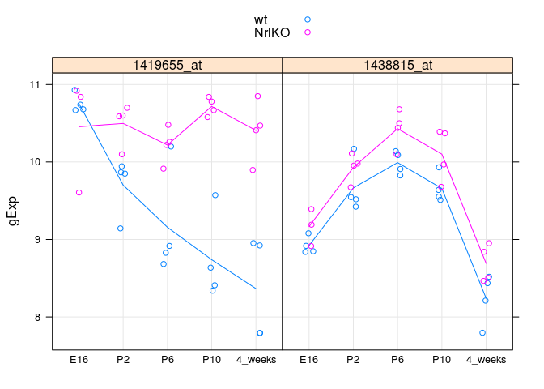
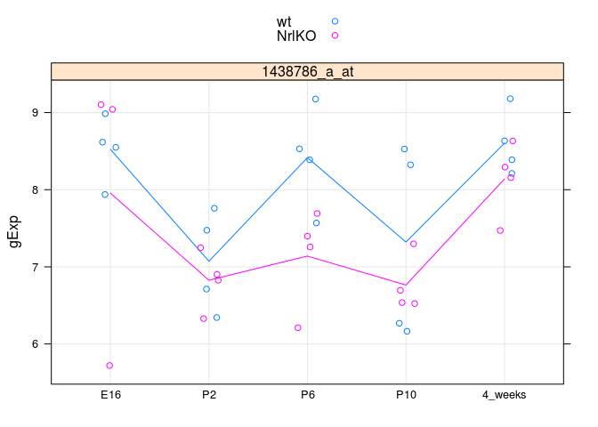
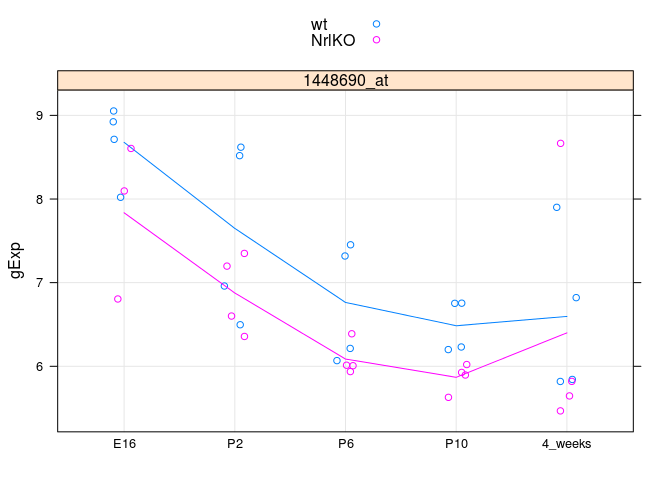
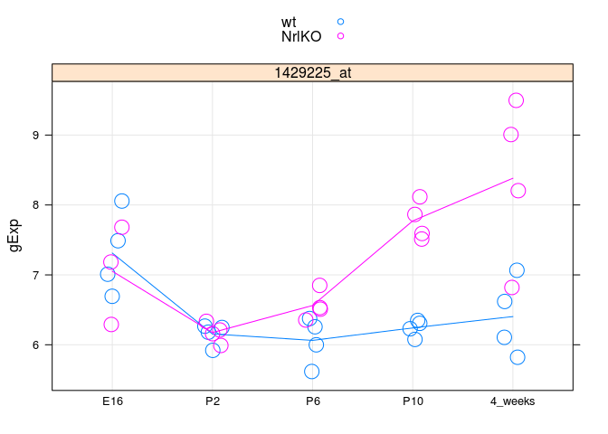

Fitting and interpreting linear models (low volume)
======================================================================

Contributors: Jenny Bryan, Dean Attali, W. Evan Durno


We will start providing less code now, since you should be generating more yourself now. Worst case, you can consult previous seminars, lectures, and your neighbor if you get stuck. Take advantage of R documentation and RStudio's facilities for accessing it.

You are also strongly encouraged to retain and develop your R code in a script.

## Brief pause to load the `photoRec` data and necessary packages

> Remember you may need to edit the file paths below, to reflect your working directory and local file storage choices.


```r
library(lattice) # if you don't already have this loaded ...
library(ggplot2) # we'll make figures with both
library(reshape2) # for the function melt
prDat <- read.table("../examples/photoRec/data/GSE4051_data.tsv")
str(prDat, max.level = 0)
```

```
## 'data.frame':	29949 obs. of  39 variables:
```

```r
prDes <- readRDS("../examples/photoRec/data/GSE4051_design.rds")
str(prDes)
```

```
## 'data.frame':	39 obs. of  4 variables:
##  $ sidChar : chr  "Sample_20" "Sample_21" "Sample_22" "Sample_23" ...
##  $ sidNum  : num  20 21 22 23 16 17 6 24 25 26 ...
##  $ devStage: Factor w/ 5 levels "E16","P2","P6",..: 1 1 1 1 1 1 1 2 2 2 ...
##  $ gType   : Factor w/ 2 levels "wt","NrlKO": 1 1 1 1 2 2 2 1 1 1 ...
```

## Write a function to prepare a mini-dataset for a small number of genes

We will be working at a low-volume today and thus will need the data for one (or maybe several) genes represented in a analysis- and visualization-friendly data.frame. Write a function that takes as input the Affymetrix probeset ID(s) and gives as output a data.frame. More details and hints given below, so read this whole section before you dive in.


I called my function `prepareData`, though you can choose any name you like. Here's a demonstration of it in action. Write your own function that takes the same input and gives the same output. (Big-picture, long-term, this foreshadows a popular software development process known as [test-driven development](http://en.wikipedia.org/wiki/Test-driven_development)).


```r
(luckyGenes <- c("1419655_at","1438815_at"))
```

```
## [1] "1419655_at" "1438815_at"
```

```r
jDat <- prepareData(luckyGenes)
str(jDat)
```

```
## 'data.frame':	78 obs. of  6 variables:
##  $ sidChar : chr  "Sample_20" "Sample_21" "Sample_22" "Sample_23" ...
##  $ sidNum  : num  20 21 22 23 16 17 6 24 25 26 ...
##  $ devStage: Factor w/ 5 levels "E16","P2","P6",..: 1 1 1 1 1 1 1 2 2 2 ...
##  $ gType   : Factor w/ 2 levels "wt","NrlKO": 1 1 1 1 2 2 2 1 1 1 ...
##  $ gExp    : num  10.93 10.74 10.67 10.68 9.61 ...
##  $ gene    : Factor w/ 2 levels "1419655_at","1438815_at": 1 1 1 1 1 1 1 1 1 1 ...
```

```r
head(jDat)
```

```
##     sidChar sidNum devStage gType   gExp       gene
## 1 Sample_20     20      E16    wt 10.930 1419655_at
## 2 Sample_21     21      E16    wt 10.740 1419655_at
## 3 Sample_22     22      E16    wt 10.670 1419655_at
## 4 Sample_23     23      E16    wt 10.680 1419655_at
## 5 Sample_16     16      E16 NrlKO  9.606 1419655_at
## 6 Sample_17     17      E16 NrlKO 10.840 1419655_at
```

```r
tail(jDat)
```

```
##      sidChar sidNum devStage gType  gExp       gene
## 73 Sample_38     38  4_weeks    wt 8.211 1438815_at
## 74 Sample_39     39  4_weeks    wt 8.436 1438815_at
## 75 Sample_11     11  4_weeks NrlKO 8.465 1438815_at
## 76 Sample_12     12  4_weeks NrlKO 8.841 1438815_at
## 77  Sample_2      2  4_weeks NrlKO 8.506 1438815_at
## 78  Sample_9      9  4_weeks NrlKO 8.952 1438815_at
```

Helpful info and tips:

  * The gene expression data for one gene is given in one row of `prDat`.
  * One row of a data.frame is still a data.frame (!), which is a list, remember? `unlist()` and `as.vector()` can be handy when converting a list or array to an atomic vector.
  * Recycling can help you.
  
To be more sure your function is working, see if your data.frame yields the same figure as this one. Don't worry if our color schemes are different. You should use the same probe IDs (at least this once) to make it easy to compare.


```r
stripplot(gExp ~ devStage | gene, jDat,
          group = gType, jitter.data = TRUE,
          auto.key = TRUE, type = c('p', 'a'), grid = TRUE)
```

 


## Write a function to stripplot a mini-dataset

You will probably make lots of these plots. Why not write a function for this? You've already got the code you need above, but you are welcome to use slightly different arguments or make it easier to specify various aspects of the figure 'on the fly'. Here's my function in action:


```r
makeStripplot(jDat)
```

 

```r
makeStripplot(jDat, pch = 17, cex = 3) # fugly, but proves I've got control!
```

 

```r
## use student-supplied function based on ggplot2
makeStripplotGg(jDat)
```

 

The ability to change plotting symbol and size is __purely optional__ and don't let that stress you out.

You can use both of your functions together and create a minidatset and plot it all at once:

```r
makeStripplot(newDat <- prepareData("1456341_a_at"))
```

 

```r
str(newDat)
```

```
## 'data.frame':	39 obs. of  6 variables:
##  $ sidChar : chr  "Sample_20" "Sample_21" "Sample_22" "Sample_23" ...
##  $ sidNum  : num  20 21 22 23 16 17 6 24 25 26 ...
##  $ devStage: Factor w/ 5 levels "E16","P2","P6",..: 1 1 1 1 1 1 1 2 2 2 ...
##  $ gType   : Factor w/ 2 levels "wt","NrlKO": 1 1 1 1 2 2 2 1 1 1 ...
##  $ gExp    : num  7.04 7.48 7.37 6.94 6.16 ...
##  $ gene    : Factor w/ 1 level "1456341_a_at": 1 1 1 1 1 1 1 1 1 1 ...
```

```r
head(newDat)
```

```
##      sidChar sidNum devStage gType  gExp         gene
## 12 Sample_20     20      E16    wt 7.044 1456341_a_at
## 13 Sample_21     21      E16    wt 7.478 1456341_a_at
## 14 Sample_22     22      E16    wt 7.374 1456341_a_at
## 15 Sample_23     23      E16    wt 6.944 1456341_a_at
## 9  Sample_16     16      E16 NrlKO 6.161 1456341_a_at
## 10 Sample_17     17      E16 NrlKO 6.931 1456341_a_at
```

Helpful info and tips:

  * When a plot does not appear and you think it should, try surrounding it with `print()`. This may be necessary inside functions, loops, etc.
  * If you can't or don't want to anticipate all the arguments you'd like to pass to, e.g. `stripplot()`, use the special function argument `...` to leave yourself flexibility.
  
## Do a two-sample t-test

Let's test for a difference in expected gene expression for probeset "1456341\_a\_at" at developmental stage P2 vs. 4 weeks post-natal (ignoring genotype, i.e. lump the wild types and knockouts together). Let's assume a common variance in the two groups.

Here's what I get:

```
## 
## 	Two Sample t-test
## 
## data:  gExp by devStage
## t = -18.8415, df = 14, p-value = 2.411e-11
## alternative hypothesis: true difference in means is not equal to 0
## 95 percent confidence interval:
##  -4.077604 -3.244146
## sample estimates:
##      mean in group P2 mean in group 4_weeks 
##              6.325750              9.986625
```

Helpful info and tips:

  * `subset()` is a handy function for subsetting a data.frame. Many functions also offer a `subset =` argument.

## Fit a linear model with a categorical covariate

In other words, do "one-way ANOVA".

Focus on probeset "1438786\_a\_at". Here's what the data should look like:

 

Let's focus just on the wild type data for now. Model expression as a function of the devStage factor. Here's what the fit tells us:

```
## 
## Call:
## lm(formula = gExp ~ devStage, data = mDat, subset = gType == 
##     "wt")
## 
## Residuals:
##      Min       1Q   Median       3Q      Max 
## -1.15650 -0.44000  0.02875  0.49150  1.20650 
## 
## Coefficients:
##                 Estimate Std. Error t value Pr(>|t|)    
## (Intercept)       8.5228     0.3788  22.498  5.7e-13 ***
## devStageP2       -1.4503     0.5357  -2.707   0.0162 *  
## devStageP6       -0.1067     0.5357  -0.199   0.8447    
## devStageP10      -1.2012     0.5357  -2.242   0.0405 *  
## devStage4_weeks   0.0810     0.5357   0.151   0.8818    
## ---
## Signif. codes:  0 '***' 0.001 '**' 0.01 '*' 0.05 '.' 0.1 ' ' 1
## 
## Residual standard error: 0.7576 on 15 degrees of freedom
## Multiple R-squared:  0.4974,	Adjusted R-squared:  0.3634 
## F-statistic: 3.712 on 4 and 15 DF,  p-value: 0.02716
```
Vet your inferential results: does the intercept look plausible given the plot? How about the `devStageP2` effect, etc.?

## Perform inference for a contrast

The "W" shape of the expression profile for "1438786\_a\_at" means that the expression values for developmental stages P2 and P10 are quite similar. We could formally test whether the P2 and P10 effects are equal or, equivalently, whether their difference is equal to zero.

First extract the parameter estimates from the linear model you fit above. You did save the fit, right? If not, edit your code to do so and re-run that bit. Hint: the `coef()` function will pull parameter estimates out of a wide array of fitted model objects in R.

```
##     (Intercept)      devStageP2      devStageP6     devStageP10 
##         8.52275        -1.45025        -0.10675        -1.20125 
## devStage4_weeks 
##         0.08100
```
Now you need to construct the contrast matrix to form the difference between the P2 and P10 effects. I called mine `contMat`. Hint: it's OK for a matrix to have just one row.


```r
(obsDiff <- contMat %*% coef(mFit))
```

```
##        [,1]
## [1,] -0.249
```
Let's check that this really is the observed difference in sample mean for the wild type mice, P2 vs. P10.

```r
(sampMeans <- aggregate(gExp ~ devStage, mDat, FUN = mean,
                        subset = gType == "wt"))
```

```
##   devStage    gExp
## 1      E16 8.52275
## 2       P2 7.07250
## 3       P6 8.41600
## 4      P10 7.32150
## 5  4_weeks 8.60375
```

```r
with(sampMeans, gExp[devStage == "P2"] - gExp[devStage == "P10"])
```

```
## [1] -0.249
```
Yes! Agrees with the observed difference we computed by multiplying our contrast matrix and the estimated parameters. If you don't get agreement, you have a problem ... probably with your contrast matrix.


Now we need the (estimated) standard error for our contrast. The variance-covariance matrix of the parameters estimated in the original model can be obtained with `vcov()` and is equal to $(X^{T}X)^{-1}\hat{\sigma}^{2}$. 

```r
vcov(mFit)
```

```
##                 (Intercept) devStageP2 devStageP6 devStageP10
## (Intercept)       0.1435072 -0.1435072 -0.1435072  -0.1435072
## devStageP2       -0.1435072  0.2870144  0.1435072   0.1435072
## devStageP6       -0.1435072  0.1435072  0.2870144   0.1435072
## devStageP10      -0.1435072  0.1435072  0.1435072   0.2870144
## devStage4_weeks  -0.1435072  0.1435072  0.1435072   0.1435072
##                 devStage4_weeks
## (Intercept)          -0.1435072
## devStageP2            0.1435072
## devStageP6            0.1435072
## devStageP10           0.1435072
## devStage4_weeks       0.2870144
```
Let's check that this is really true. If we take the diagonal elements and take their square root, they should be exactly equal to the standard errors reported for out original model. Are they?

```r
summary(mFit)$coefficients[ , "Std. Error"]
```

```
##     (Intercept)      devStageP2      devStageP6     devStageP10 
##       0.3788234       0.5357372       0.5357372       0.5357372 
## devStage4_weeks 
##       0.5357372
```

```r
sqrt(diag(vcov(mFit)))
```

```
##     (Intercept)      devStageP2      devStageP6     devStageP10 
##       0.3788234       0.5357372       0.5357372       0.5357372 
## devStage4_weeks 
##       0.5357372
```
Yes! Note for the future that you can get the typical matrix of inferential results from most fitted model objects for further computing like so:

```r
summary(mFit)$coefficients
```

```
##                 Estimate Std. Error    t value     Pr(>|t|)
## (Intercept)      8.52275  0.3788234 22.4979484 5.697244e-13
## devStageP2      -1.45025  0.5357372 -2.7070174 1.622876e-02
## devStageP6      -0.10675  0.5357372 -0.1992581 8.447367e-01
## devStageP10     -1.20125  0.5357372 -2.2422373 4.048697e-02
## devStage4_weeks  0.08100  0.5357372  0.1511935 8.818377e-01
```
Returning to our test of the P2 vs. P10 contrast, recall that the variance-covariance matrix of a contrast obtained as $C\hat{\alpha}$ is $C(X^{T}X)^{-1}C^{T}\hat{\sigma}^{2}$.

```r
(estSe <- contMat %*% vcov(mFit) %*% t(contMat))
```

```
##           [,1]
## [1,] 0.2870144
```
Now we form a test statistic as an observed effect divided by its estimated standard error:

```r
(testStat <- obsDiff/estSe)
```

```
##            [,1]
## [1,] -0.8675523
```
Under the null hypothesis that the contrast equals zero, i.e. there is no true difference in mean for expression at P2 and P10 in wild type mice for this gene, the test statistic has a $t$ distribution with $n - p = 20 - 5 = 15$ degrees of freedom. We compute a two-sided p-value and we're done.

```r
2 * pt(abs(testStat), df = df.residual(mFit), lower.tail = FALSE)
```

```
##           [,1]
## [1,] 0.3993062
```
Not surprisingly, this p-value is rather large and thus we have insufficient evidence to conclude a significant difference.

## Fit a linear model with two categorical covariates

Let's focus on probeset "1448690_at". Use your functions to prepare the data and plot it. I'm calling mine `oDat`.

```r
makeStripplot(oDat <- prepareData("1448690_at"))
```

 

```r
str(oDat)
```

```
## 'data.frame':	39 obs. of  6 variables:
##  $ sidChar : chr  "Sample_20" "Sample_21" "Sample_22" "Sample_23" ...
##  $ sidNum  : num  20 21 22 23 16 17 6 24 25 26 ...
##  $ devStage: Factor w/ 5 levels "E16","P2","P6",..: 1 1 1 1 1 1 1 2 2 2 ...
##  $ gType   : Factor w/ 2 levels "wt","NrlKO": 1 1 1 1 2 2 2 1 1 1 ...
##  $ gExp    : num  8.02 9.05 8.71 8.92 6.8 ...
##  $ gene    : Factor w/ 1 level "1448690_at": 1 1 1 1 1 1 1 1 1 1 ...
```
Fit a linear model with covariates `gType` and `devStage` and include their interactions. I'm calling mine `oFitBig` and here's an excerpt of the report you should get.


```r
summary(oFitBig)$coef
```

```
##                               Estimate Std. Error     t value     Pr(>|t|)
## (Intercept)                 8.67800000  0.3986668 21.76754966 1.634011e-19
## gTypeNrlKO                 -0.84233333  0.6089736 -1.38320163 1.771604e-01
## devStageP2                 -1.02900000  0.5638000 -1.82511517 7.830030e-02
## devStageP6                 -1.91450000  0.5638000 -3.39570748 2.002778e-03
## devStageP10                -2.19325000  0.5638000 -3.89012036 5.387044e-04
## devStage4_weeks            -2.08200000  0.5638000 -3.69279862 9.148816e-04
## gTypeNrlKO:devStageP2       0.06983333  0.8298912  0.08414758 9.335173e-01
## gTypeNrlKO:devStageP6       0.16533333  0.8298912  0.19922291 8.434787e-01
## gTypeNrlKO:devStageP10      0.22583333  0.8298912  0.27212403 7.874548e-01
## gTypeNrlKO:devStage4_weeks  0.64608333  0.8298912  0.77851572 4.425713e-01
```
Vet the results. Is the intercept plausible? How about the various effects? Do the ones with small p-values, e.g. meeting a conventional cut-off of 0.05, look 'real' to you?

Fit a related, smaller model with the same covariates, but this time omit the interaction. I'm calling mine `oFitSmall` and here's an excerpt of the report you should get.


```r
summary(oFitSmall)$coef
```

```
##                   Estimate Std. Error   t value     Pr(>|t|)
## (Intercept)      8.5803162  0.3046461 28.164864 1.177029e-24
## gTypeNrlKO      -0.6144044  0.2430235 -2.528168 1.643264e-02
## devStageP2      -1.0103640  0.3924016 -2.574821 1.470127e-02
## devStageP6      -1.8481140  0.3924016 -4.709752 4.327597e-05
## devStageP10     -2.0966140  0.3924016 -5.343032 6.703381e-06
## devStage4_weeks -1.7752390  0.3924016 -4.524036 7.443740e-05
```
Now let's determine if the interaction terms are truly necessary. From the plot, the case for interaction seems very weak. This can be assessed with an F test that essentially looks at the reduction in the sum of squared residuals due to using a larger, more complicated model and determines if it is "big enough" given the number of additional parameters used. Recall the `anova()` function can take two fitted models, one nested within the other, and perform this test. (`anova()` can also be used on a single model to assess significance of terms, but remember the problem with the standard `anova()` function and unbalanced data. See references given in lecture for remedies.)

```
## Analysis of Variance Table
## 
## Model 1: gExp ~ gType + devStage
## Model 2: gExp ~ gType * devStage
##   Res.Df    RSS Df Sum of Sq      F Pr(>F)
## 1     33 18.933                           
## 2     29 18.436  4    0.4966 0.1953 0.9389
```
With a p-value awfully close to one, we confirm that, no, there is no evidence for interaction in this particular case.

If you'd like to get a more exciting result, take a look at probeset "1429225_at". Here are my plots, excerpts from the fitted model reports, and the F test for interaction. See if you can duplicate this.

 

```
##                              Estimate Std. Error    t value     Pr(>|t|)
## (Intercept)                 7.3125000  0.2617295 27.9391470 1.619124e-22
## gTypeNrlKO                 -0.2601667  0.3997985 -0.6507445 5.203345e-01
## devStageP2                 -1.1582500  0.3701415 -3.1292090 3.973410e-03
## devStageP6                 -1.2495000  0.3701415 -3.3757364 2.109615e-03
## devStageP10                -1.0717500  0.3701415 -2.8955146 7.124584e-03
## devStage4_weeks            -0.9087500  0.3701415 -2.4551424 2.031796e-02
## gTypeNrlKO:devStageP2       0.2804167  0.5448335  0.5146833 6.106750e-01
## gTypeNrlKO:devStageP6       0.7589167  0.5448335  1.3929332 1.742271e-01
## gTypeNrlKO:devStageP10      1.7914167  0.5448335  3.2880077 2.647561e-03
## gTypeNrlKO:devStage4_weeks  2.2389167  0.5448335  4.1093596 2.970497e-04
```

```
##                   Estimate Std. Error    t value     Pr(>|t|)
## (Intercept)      6.8651765  0.2722124 25.2199286 3.847733e-23
## gTypeNrlKO       0.7835882  0.2171503  3.6085055 1.006657e-03
## devStageP2      -1.0925956  0.3506251 -3.1161367 3.780029e-03
## devStageP6      -0.9445956  0.3506251 -2.6940334 1.101250e-02
## devStageP10     -0.2505956  0.3506251 -0.7147110 4.798134e-01
## devStage4_weeks  0.1361544  0.3506251  0.3883191 7.002738e-01
```

```
## Analysis of Variance Table
## 
## Model 1: gExp ~ gType + devStage
## Model 2: gExp ~ gType * devStage
##   Res.Df     RSS Df Sum of Sq      F    Pr(>F)    
## 1     33 15.1163                                  
## 2     29  7.9463  4      7.17 6.5418 0.0007028 ***
## ---
## Signif. codes:  0 '***' 0.001 '**' 0.01 '*' 0.05 '.' 0.1 ' ' 1
```

Not surprisingly, the interaction here is highly statistically significant.

## Take-home problems

First, load the `1438786_a_at` expression data and call it `mDat`. It has been preprepared for you to download.

```r
mDat = read.table("../examples/photoRec/data/mDat.tsv",header=T,sep="\t",row.names=1)
```

  1. Estimate the effect of `devStage` on `mDat` with a linear model by using `lm()`. You will want to use the following formula: `gExp ~ devStage`. What stages are significantly different from `4_weeks`? Use `summary()` to get your results.
  2. Run the exact same test on `mDat` values with genotype "NrlKO". What are the differences between this test and the last one?
  3. Fit a linear model of the expression of `1438786_a_at` as a linear model of `devStage` and `gType` without interactions. Use the following formula: `gExp ~ devStage + gType`.
  4. Fit a linear model of the expression of `1438786_a_at` as a linear model of `devStage` and `gType` with interactions. Use the following formula `gExp ~ devStage * gType`. Is this model different from the model without interctions?
  5. Run an anova comparing the models from questions 3 and 4. Are the models significantly different?
  6. We are now going to create a batch effect and control for it in our analysis using a blocking variable. Run the following code block to create a new data set, `bDat`, with a batch effect. 

```r
batches = as.character( rep(c("batch1","batch2"),20)[1:39] )
batchEffect = rep( c(0,4),20 )[1:39]
bDat = mDat
bDat$gExp = bDat$gExp + batchEffect 
summary( lm( gExp ~ devStage * gType , data=bDat ) )
```
  How has the batch effect changed the result of the test? How is it different from the result of question 4? 

  7. Fit a new linear model with the formula `gExp ~ devStage * gType + batches` using `data=bDat`. How is this similar to the results of question 4? In this case, `batches` is our blocking variable. By including `batches` in the model we can estimate the effect of contamination in our data caused by the difference in batches and get back to testing hypotheses we're really interested in, like the effect of knockouts!
  8. Run an `anova` comparing the two formulae `gExp ~ devStage + gType + batches` and `gExp ~ devStage * gType + batches`. How are these results similar to that of question 5?

## Ideas for further work (not take-home problems)

We wrote functions to prepare and plot data for more than 1 gene. But when we started fitting models and conducting tests, we only worked with 1 gene at a time. Can you use data aggregation strategies from last week to do some of the same work for small sets of genes?

In lecture we also experimented with a quantitative version of devStage, which we called `age`. This opens the door to modelling with a quantitative covariate. Can you fit linear and quadratic models to the expression data for one or several genes?

I noticed that the 4 week developmental stage generally posed a difficult fitting problem for the quadratic model where we regressed expression on age. I think it is simply too far separated in time to be easily modelled quantitatively with the other 4 developmental stages. It would be interesting to drop the 4 week data and revisit this dataset with linear and quadratic models.

Today we used `lattice`'s `type = 'a'` argument to get a "connect-the-dots" representation of sample means, which coincide with the model fits from ANOVA-type models. But the ability to use built-in automagic tools for overlaying the fit dies off once you start to consider more flexible models, like those involving `age`, especially in the presence of a second categorical covariate, like genotype. In your graphing environment of choice -- base or `lattice` or `ggplot2` -- start to figure out how you can add fitted regression curves to your scatterplots. It is definitely easiest to do this in base graphics but if you're going to get good at `lattice` or `ggplot2` then by all means start to tinker there.   
