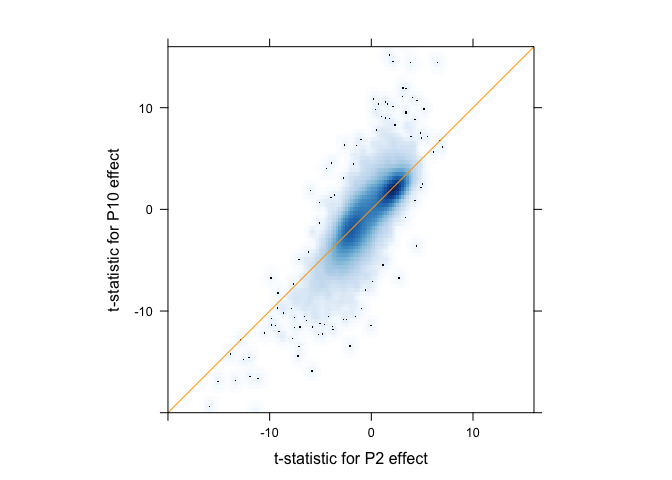
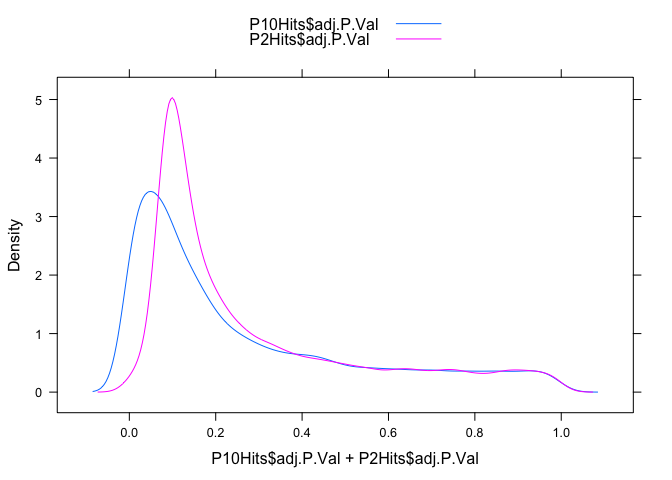
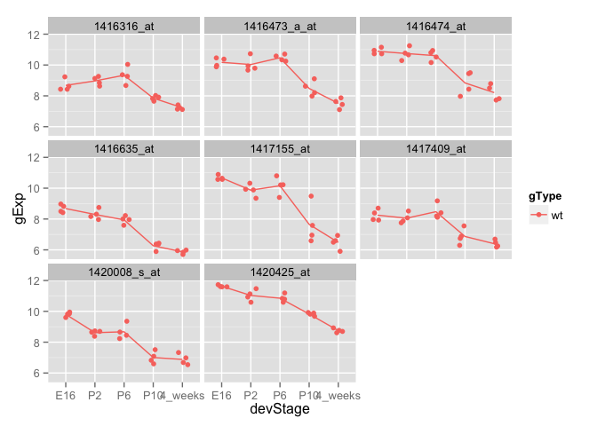
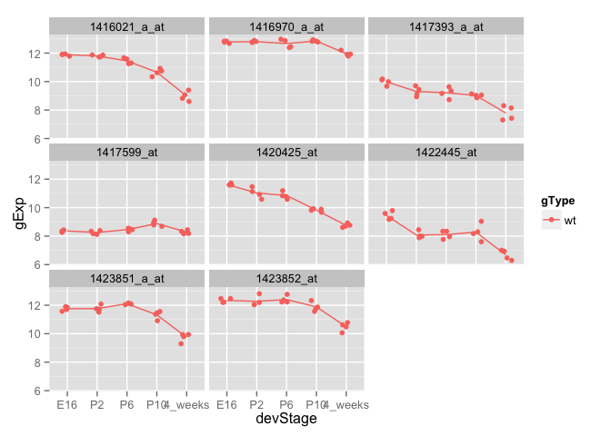
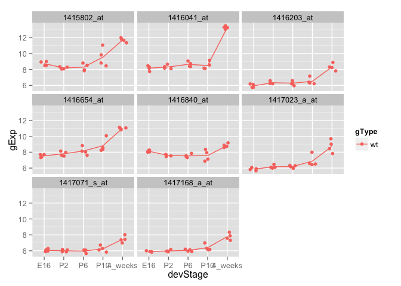
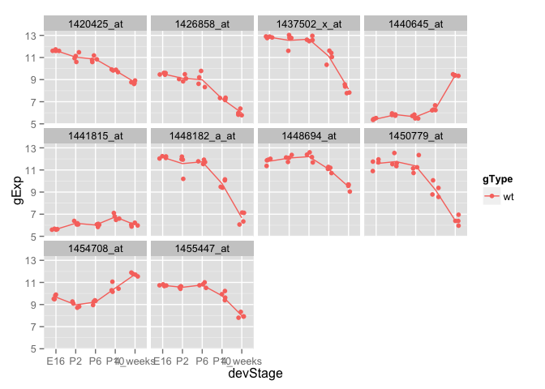
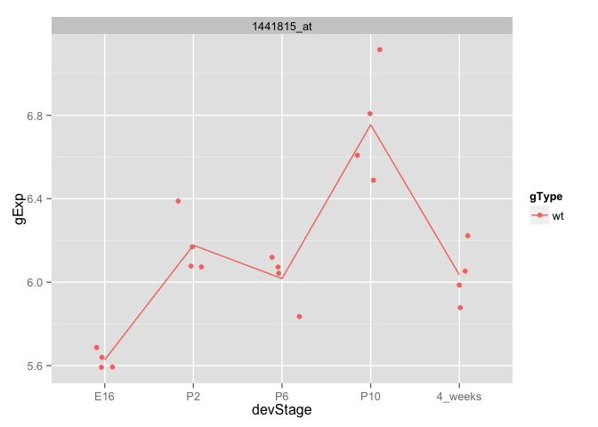
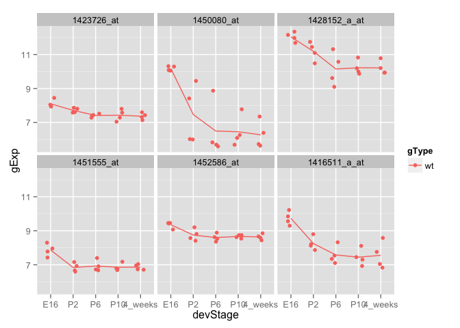

Fitting and interpreting linear models (high volume)
====================================================

Contributors: Jenny Bryan. Updated by Alice Zhu

In the spirit of "teaching you to fish", I'll be providing less code for things you've done before. As always, you are also strongly encouraged to retain and develop your R code in a script.

## Preliminaries

If you haven't done so already, install `limma` (I'm copying [instructions found here](http://bioinf.wehi.edu.au/limma/)):


```r
source("http://www.bioconductor.org/biocLite.R")
biocLite("limma")
biocLite("statmod")
```
Load the `limma` and/or `lattice` package, if you need to:

```r
library(limma)
library(lattice)
library(ggplot2)
```

> As usual, `ggplot2` is warmly welcomed as an alternative graphing package.

Load the `photoRec` dataset:

> Remember you may need to edit the file paths below, to reflect your working directory and local file storage choices.


```r
prDat <- read.table("GSE4051_data.tsv")
str(prDat, max.level = 0)
```

```
## 'data.frame':	29949 obs. of  39 variables:
```

```r
prDes <- readRDS("GSE4051_design.rds")
str(prDes)
```

```
## 'data.frame':	39 obs. of  4 variables:
##  $ sidChar : chr  "Sample_20" "Sample_21" "Sample_22" "Sample_23" ...
##  $ sidNum  : num  20 21 22 23 16 17 6 24 25 26 ...
##  $ devStage: Factor w/ 5 levels "E16","P2","P6",..: 1 1 1 1 1 1 1 2 2 2 ...
##  $ gType   : Factor w/ 2 levels "wt","NrlKO": 1 1 1 1 2 2 2 1 1 1 ...
```

You might want to use the functions you wrote last week to extract and stripplot excerpts from the `photoRec` dataset. If you stored the code defining those functions cleanly in a script, you could make them available now by using the `source()` function.


## The difficulty in estimating gene-wise variance

The `lmFit` function from `limma` is arguably your main workhorse function for fitting a common linear model to the data for a very large number of genes. It has at least two strengths to recommend it:

  * It does this in a computationally efficient way, i.e. better than you writing a top-level `for()` loop and probably even better than pursuing an `apply()`-type strategy.
  * It borrows strength across the large number of genes (= datasets) to moderate the gene-wise estimate of error variance.
  
Before we dive in and start using `limma` with the `photoRec` dataset, let's do a small simulation to illustrate how lousy variance estimates can be when the number of samples is small.

Let's simulate data for 1000 genes. For each gene, we get 3 observations from a normal distribution with mean 0 and variance 1. We generate the data for each gene independent of the others.


```r
m <- 1000
n <- 3
x <- matrix(rnorm(m * n), nrow = m)
```
Let's take the observed gene-wise variances. Yes, folks, we are estimating variance with samples of size 3. People do this all the time -- remember the video? We inspect them a bit numerically and graphically.

```r
obsVars <- apply(x, 1, var)
summary(obsVars)
```

```
##     Min.  1st Qu.   Median     Mean  3rd Qu.     Max. 
## 0.000043 0.262200 0.613100 0.959800 1.327000 6.827000
```

```r
mean(obsVars < 1/3)
```

```
## [1] 0.312
```

```r
densityplot(~ obsVars, n = 200)
```

 
Notice how many of the observed variances are freakishly small (and freakishly large!), even though they are indeed equal to 1 "on average". For example, we see that at least a quarter of the genes appear to exhibit a sample variance that is less than one-third the true variance. This can wreak havoc with statistical inference, such as t-statistics. This is what `limma` -- or the statistical methods it embodies, actually -- is designed to combat.

Optional take-home exercise: Make the above simulation more realistic with two (or more) groups, different data-generating means and group differences, different data-generating gene-wise variances, etc.

## Fit a linear model: explain gene expression in the wild type mice as a function of developmental stage (one-way ANOVA)

Let's just work with the wild type data.


```r
wtDes <- subset(prDes, gType == "wt")
str(wtDes)
```

```
## 'data.frame':	20 obs. of  4 variables:
##  $ sidChar : chr  "Sample_20" "Sample_21" "Sample_22" "Sample_23" ...
##  $ sidNum  : num  20 21 22 23 24 25 26 27 28 29 ...
##  $ devStage: Factor w/ 5 levels "E16","P2","P6",..: 1 1 1 1 2 2 2 2 3 3 ...
##  $ gType   : Factor w/ 2 levels "wt","NrlKO": 1 1 1 1 1 1 1 1 1 1 ...
```

```r
wtDat <- subset(prDat, select = prDes$gType == "wt")
str(wtDat, max.level = 0)
```

```
## 'data.frame':	29949 obs. of  20 variables:
```
Before we can use `limma` we must make our design matrix. Let's accept the default "ref + treatment effects" scheme for handling the `devStage` factor. I encourage you to inspect the design matrix and confirm it's what you expect.

```r
wtDesMat <- model.matrix(~ devStage, wtDes)
str(wtDesMat)
```

```
##  num [1:20, 1:5] 1 1 1 1 1 1 1 1 1 1 ...
##  - attr(*, "dimnames")=List of 2
##   ..$ : chr [1:20] "12" "13" "14" "15" ...
##   ..$ : chr [1:5] "(Intercept)" "devStageP2" "devStageP6" "devStageP10" ...
##  - attr(*, "assign")= int [1:5] 0 1 1 1 1
##  - attr(*, "contrasts")=List of 1
##   ..$ devStage: chr "contr.treatment"
```
Now we will fit the model, for all probes at once, and use `eBayes()` to moderate the estimated error variances:

```r
wtFit <- lmFit(wtDat, wtDesMat)
wtEbFit <- eBayes(wtFit)
```
The first thing we might ask is "which genes show differential expression over the course of development"? This can be addressed with an overall F test for the model. In the language used in lecture, we will compare a "big" model to a "small" model, where the "big" model includes a mean parameter (or effect) for each level of `devStage` and the "small" model includes a single mean parameter, e.g. an intercept. You might expect this to be the F test performed by `topTable()` by default, i.e. when no specific coefficients or contrasts are given to the `coef` argument ...

If you are using the older version of limma, the output will look like this:


```r
topTable(wtEbFit)
```


```
##              X.Intercept. devStageP2 devStageP6 devStageP10
## 1423641_s_at      12.1800    -0.0175     0.0750      0.0675
## 1438940_x_at      12.8625     0.0850     0.1325      0.3425
## 1438657_x_at      12.7825     0.1400     0.1250     -0.1850
## 1456736_x_at      12.3225     0.1625     0.3050      0.2075
## 1436884_x_at      12.9275     0.1775     0.3225      0.0300
## 1419700_a_at      12.3200     0.1650     0.6475      0.8175
## 1435800_a_at      12.2850     0.0450     0.6825      0.9000
## 1454613_at        12.4675    -0.1075    -0.0500     -0.1025
## 1451240_a_at      12.9975     0.3100     0.2800      0.2800
## 1450084_s_at      12.6350     0.0825     0.0525      0.1725
##              devStage4_weeks AveExpr        F      P.Value    adj.P.Val
## 1423641_s_at          0.1800 12.2410 45349.98 3.573822e-36 5.201351e-32
## 1438940_x_at          0.3500 13.0445 44956.74 3.864588e-36 5.201351e-32
## 1438657_x_at         -0.4500 12.7085 43485.87 5.210208e-36 5.201351e-32
## 1456736_x_at          0.0725 12.4720 39508.56 1.233083e-35 6.725010e-32
## 1436884_x_at          0.0250 13.0385 39269.42 1.302189e-35 6.725010e-32
## 1419700_a_at          0.6825 12.7825 39120.82 1.347292e-35 6.725010e-32
## 1435800_a_at          1.0200 12.8145 36668.31 2.409850e-35 1.031037e-31
## 1454613_at           -0.3825 12.3390 35835.07 2.962415e-35 1.077791e-31
## 1451240_a_at         -0.3700 13.0975 35480.84 3.238879e-35 1.077791e-31
## 1450084_s_at          0.2600 12.7485 34410.51 4.264522e-35 1.234197e-31
```

However, if you are using the current release, the output will look like this:

```r
topTable(wtEbFit)
```

```
## Removing intercept from test coefficients
```

```
##              devStageP2 devStageP6 devStageP10 devStage4_weeks AveExpr
## 1440645_at      0.39900    0.19525     0.92000         3.96125 6.52835
## 1416041_at      0.15800    0.47975     0.33275         5.11450 9.38250
## 1425222_x_at    0.88200    0.79950     1.54875         5.53175 7.02815
## 1451635_at      1.30250    1.19000     2.01600         6.18825 8.31860
## 1429028_at     -2.44325   -3.40725    -4.31050        -4.60175 8.04495
## 1422929_s_at   -2.91175   -3.61825    -3.54725        -3.66125 7.27830
## 1424852_at      0.45750    0.22975     0.57400         3.97900 7.45405
## 1425171_at      0.99800    3.05300     5.27875         6.07875 9.62045
## 1451617_at      0.72550    2.51275     4.98375         6.68475 8.81660
## 1451618_at      0.60275    2.89025     5.05075         6.28825 9.43065
##                     F      P.Value    adj.P.Val
## 1440645_at   425.4464 1.587779e-17 4.755241e-13
## 1416041_at   195.4574 1.522363e-14 2.279662e-10
## 1425222_x_at 173.3572 4.348283e-14 4.340891e-10
## 1451635_at   157.3341 1.013031e-13 7.584816e-10
## 1429028_at   148.7971 1.645967e-13 9.202951e-10
## 1422929_s_at 146.8672 1.843725e-13 9.202951e-10
## 1424852_at   143.2443 2.290408e-13 9.799345e-10
## 1425171_at   138.8483 3.001762e-13 1.123747e-09
## 1451617_at   136.4774 3.485203e-13 1.159759e-09
## 1451618_at   134.2025 4.031647e-13 1.207438e-09
```


You'll see that, by default, `topTable()` reports the top 10 hits. 

If you are using the older version, let's take more care and specify explicitly the coefficients we want to test for equality with zero. Recall that one can specify these by number but I recommend doing this by name.


```r
## this call will work but I don't like it
topTable(wtEbFit, coef = 2:5) # cryptic! error-prone!
```


```r
colnames(coef(wtEbFit)) # remind yourself of the coef names
```

```
## [1] "(Intercept)"     "devStageP2"      "devStageP6"      "devStageP10"    
## [5] "devStage4_weeks"
```

```r
(dsHits <- topTable(wtEbFit,
                    coef = grep("devStage", colnames(coef(wtEbFit)))))
```

```
##              devStageP2 devStageP6 devStageP10 devStage4_weeks AveExpr
## 1440645_at      0.39900    0.19525     0.92000         3.96125 6.52835
## 1416041_at      0.15800    0.47975     0.33275         5.11450 9.38250
## 1425222_x_at    0.88200    0.79950     1.54875         5.53175 7.02815
## 1451635_at      1.30250    1.19000     2.01600         6.18825 8.31860
## 1429028_at     -2.44325   -3.40725    -4.31050        -4.60175 8.04495
## 1422929_s_at   -2.91175   -3.61825    -3.54725        -3.66125 7.27830
## 1424852_at      0.45750    0.22975     0.57400         3.97900 7.45405
## 1425171_at      0.99800    3.05300     5.27875         6.07875 9.62045
## 1451617_at      0.72550    2.51275     4.98375         6.68475 8.81660
## 1451618_at      0.60275    2.89025     5.05075         6.28825 9.43065
##                     F      P.Value    adj.P.Val
## 1440645_at   425.4464 1.587779e-17 4.755241e-13
## 1416041_at   195.4574 1.522363e-14 2.279662e-10
## 1425222_x_at 173.3572 4.348283e-14 4.340891e-10
## 1451635_at   157.3341 1.013031e-13 7.584816e-10
## 1429028_at   148.7971 1.645967e-13 9.202951e-10
## 1422929_s_at 146.8672 1.843725e-13 9.202951e-10
## 1424852_at   143.2443 2.290408e-13 9.799345e-10
## 1425171_at   138.8483 3.001762e-13 1.123747e-09
## 1451617_at   136.4774 3.485203e-13 1.159759e-09
## 1451618_at   134.2025 4.031647e-13 1.207438e-09
```

You will notice that these are __not__ the same hits we got with our first call to `topTable()` for older version limma. Compare, e.g., the Affy IDs for the top hits and/or look at the typical F statistic magnitudes. And so we learn that you really must use the `coef` argument (or a contrasts workflow in more complicated settings) to explicitly define __what you regard as a hit__.

Use the hit list you stored above and your functions for extracting and plotting data to produce this plot for hits 3, 6, and 9 on the list.

 

Does it look plausible to you that -- using only wild type data -- these probes show the most compelling evidence for expression change over development? Note: I have redefined my data extraction and plotting functions to include only the wild type data. You can do that or not, as long as you can remember that all of today's models only work with wild type data.

Optional exercise: use `lm()` on one or all 3 of these probes and check if the F stats and p-values are similar. Don't expect exact equality because you must remember that `limma` has moderated the estimated error variance.

## Be the boss of `topTable()`

You need to learn to take control of `topTable()` by using various arguments to get the hits you want in the order you want. Furthermore, you should familiarize yourself with the output it returns, so you are comfortable extracting the output that you need.

How many probes have Benjamini-Hochberg ("BH") adjusted p-values for the F test conducted above that are less than 1e-05?

My answer: 350 probes.

What is the 63rd hit on this list? Provide it's Affy ID, F statistic, BH adjusted p-value, and the estimated effect for developmental stage "P6" __in that order__. Here's what I get:

```
##                    F    adj.P.Val devStageP6
## 1451633_a_at 64.0104 1.048908e-07      2.069
```

Consider the effects associated with developmental stages P2 and P10. Scatterplot the t statistics for the test that the P2 effect is zero against that for P10. Ideally this plot would be a high-volume scatterplot, include an `x = y` line,  and have an aspect ratio of 1 and common axes, but just do your best. Here's what I get:


```
## (loaded the KernSmooth namespace)
```

 


And now a ggplot version:
 

Create a densityplot of the associated adjusted p-values, so you can get a sense of which developmental stage, P2 or P10, is more clearly distinguished from baseline E16.

 


ggplot version:
 

Is this what you'd expect?

If you require a BH adjusted p-value less than 1e-03, how many hits do you get for P2? How many for P10? How much overlap is there?

```
##        P10
## P2      FALSE  TRUE   Sum
##   FALSE 29201   695 29896
##   TRUE      1    52    53
##   Sum   29202   747 29949
```
I get 53 hits for P2, 747 for P10, with an overlap of 52.

Now just focus on the P10 effect. Create a scatterplot matrix of raw p-values, BH adjusted p-values, and BY p-values.

 

GGally version:

```r
# installed the package if you have not
#install.packages("GGally")
library(GGally)
pg <- ggpairs(P10pVals)
print(pg)
```

 


The plots along the diagonal line are the density plot for raw, BH, and BY values, respectively.


Is the relationship between raw and BH p-values (see the correlation between raw and BH in the `ggpairs` plot) what you expect? I'm not sure what to say about the BY p-values. I just wanted us to try at least one different method of p-value adjustment.

## Perform inference for some contrasts

Let's try to distinguish genes that have stable expression at the last three developmental stages (P6, P10, and 4_weeks) from those that do not. If expression doesn't change from P6 to P10 to 4_weeks, then the effects for all 3 of those developmental stages should be the same. That means that the difference between the P10 and P6 effects is zero and ditto for the difference between 4_weeks effect and P10 (or P6, for that matter). Let's form these contrasts.

```r
colnames(wtDesMat)
```

```
## [1] "(Intercept)"     "devStageP2"      "devStageP6"      "devStageP10"    
## [5] "devStage4_weeks"
```

```r
(cont.matrix <- makeContrasts(
    P10VsP6 = devStageP10 - devStageP6,
    fourweeksVsP10 = devStage4_weeks - devStageP10,
    levels = wtDesMat))
```

```
## Warning in makeContrasts(P10VsP6 = devStageP10 - devStageP6,
## fourweeksVsP10 = devStage4_weeks - : Renaming (Intercept) to Intercept
```

```
##                  Contrasts
## Levels            P10VsP6 fourweeksVsP10
##   Intercept             0              0
##   devStageP2            0              0
##   devStageP6           -1              0
##   devStageP10           1             -1
##   devStage4_weeks       0              1
```

```r
wtFitCont <- contrasts.fit(wtFit, cont.matrix)
```

```
## Warning in contrasts.fit(wtFit, cont.matrix): row names of contrasts don't
## match col names of coefficients
```

```r
wtEbFitCont <- eBayes(wtFitCont)
```
What does `topTable()` do with our contrasts?

```r
topTable(wtEbFitCont)
```

```
##               P10VsP6 fourweeksVsP10 AveExpr        F      P.Value
## 1440645_at    0.72475        3.04125 6.52835 632.7410 2.224325e-17
## 1416041_at   -0.14700        4.78175 9.38250 302.3940 1.472973e-14
## 1425222_x_at  0.74925        3.98300 7.02815 235.3682 1.299509e-13
## 1424852_at    0.34425        3.40500 7.45405 225.1087 1.910320e-13
## 1420726_x_at  0.17325        3.55125 7.19000 203.5215 4.555385e-13
## 1451635_at    0.82600        4.17225 8.31860 200.0177 5.289072e-13
## 1429394_at   -0.09800        2.40975 7.84825 167.4991 2.416043e-12
## 1455447_at   -0.97650       -1.79975 9.97295 153.5444 5.063369e-12
## 1429791_at    0.24800        1.65825 8.02555 145.7407 7.877494e-12
## 1422612_at    0.48375        3.42600 8.83255 142.2388 9.676005e-12
##                 adj.P.Val
## 1440645_at   6.661631e-13
## 1416041_at   2.205703e-10
## 1425222_x_at 1.297300e-09
## 1424852_at   1.430304e-09
## 1420726_x_at 2.640040e-09
## 1451635_at   2.640040e-09
## 1429394_at   1.033687e-08
## 1455447_at   1.895536e-08
## 1429791_at   2.621367e-08
## 1422612_at   2.840295e-08
```
The top hits are probes where there is big change from P6 to P10, from P10 to 4_weeks, or both. Let's check that by plotting the data from the top 4 hits.

 

So far, so good. These 4 probes show little expression change from P6 to P10 and a strong increase from P10 to 4_weeks. I would like to find some where there's a change in each case but perhaps in opposite direction. Let's press on.

Let's use `decideTests()` to adjust the p-values for both contrasts globally, i.e. all together and then threshhold them at a cutoff of 1e-04.

```r
cutoff <- 1e-04
wtResCont <- decideTests(wtEbFitCont, p.value = cutoff, method = "global")
summary(wtResCont)
```

```
##    P10VsP6 fourweeksVsP10
## -1       4              8
## 0    29945          29895
## 1        0             46
```
We see there are 4 probes that go down from P6 to P10 and no hits going the other way. There are 8 probes that go down from P10 to 4_weeks and 46 going the other way. Let's try to pull out various hits and plot their data.

Here are the 4 that decline from P6 to P10.

```r
(hits1 <- rownames(prDat)[which(wtResCont[, "P10VsP6"] < 0)])
```

```
## [1] "1416635_at" "1437781_at" "1454752_at" "1455260_at"
```

```r
stripplotIt(prepareData(hits1))
```

 

Here are 4 of the 8 that decline from P10 to 4_weeks.

```r
(hits2 <- rownames(prDat)[which(wtResCont[, "fourweeksVsP10"] < 0)])
```

```
## [1] "1416021_a_at" "1423851_a_at" "1434500_at"   "1435415_x_at"
## [5] "1437502_x_at" "1448182_a_at" "1452679_at"   "1455447_at"
```

```r
stripplotIt(prepareData(hits2[1:4]))
```

 

Is there any overlap between these probes?

```r
intersect(hits1, hits2)
```

```
## character(0)
```
Apparently not.

Here are 4 of the 46 that increase from P10 to 4_weeks.


```r
(hits3 <- rownames(prDat)[which(wtResCont[, "fourweeksVsP10"] > 0)])
```

```
##  [1] "1416041_at"   "1417280_at"   "1418406_at"   "1418710_at"  
##  [5] "1418789_at"   "1419069_at"   "1420725_at"   "1420726_x_at"
##  [9] "1421061_at"   "1421818_at"   "1422612_at"   "1424852_at"  
## [13] "1424895_at"   "1425222_x_at" "1426059_at"   "1426223_at"  
## [17] "1427388_at"   "1428763_at"   "1429394_at"   "1429791_at"  
## [21] "1430580_at"   "1431174_at"   "1433699_at"   "1434297_at"  
## [25] "1434573_at"   "1435436_at"   "1435679_at"   "1435727_s_at"
## [29] "1436265_at"   "1436287_at"   "1440402_at"   "1440645_at"  
## [33] "1441518_at"   "1442243_at"   "1443252_at"   "1446484_at"  
## [37] "1449170_at"   "1449393_at"   "1451042_a_at" "1451635_at"  
## [41] "1452243_at"   "1453385_at"   "1455493_at"   "1457878_at"  
## [45] "1458418_at"   "1459904_at"
```

```r
stripplotIt(prepareData(hits3[1:4]))
```

 

Is there any overlap between these probes and the previous "down" hits?


```r
intersect(hits1, hits3)
```

```
## character(0)
```

```r
intersect(hits2, hits3)
```

```
## character(0)
```

That's disappointing. If I revisit this workflow but make the p-value cutoff less stringent, maybe I can find the gene expression profile I'm looking for.


```r
cutoff <- 1e-02
nHits <- 8
wtResCont <- decideTests(wtEbFitCont,p.value = cutoff, method = "global")
summary(wtResCont)
```

```
##    P10VsP6 fourweeksVsP10
## -1      40             49
## 0    29897          29636
## 1       12            264
```

```r
hits1 <- rownames(prDat)[which(wtResCont[, "P10VsP6"] < 0)]
stripplotIt(prepareData(hits1[1:nHits]))
```

 

```r
hits2 <- rownames(prDat)[which(wtResCont[, "fourweeksVsP10"] < 0)]
stripplotIt(prepareData(hits2[1:nHits]))
```

 

```r
hits3 <- rownames(prDat)[which(wtResCont[, "P10VsP6"] > 0)]
stripplotIt(prepareData(hits3[1:nHits]))
```

 

```r
hits4 <- rownames(prDat)[which(wtResCont[, "fourweeksVsP10"] > 0)]
stripplotIt(prepareData(hits4[1:nHits]))
```

 

```r
vennDiagram(wtResCont)
```

 

```r
hits5 <- rownames(prDat)[which(wtResCont[, "P10VsP6"] != 0 &
                                  wtResCont[, "fourweeksVsP10"] != 0)]
stripplotIt(prepareData(hits5))
```

 

```r
hits6 <- rownames(prDat)[which(wtResCont[, "P10VsP6"] > 0 &
                                  wtResCont[, "fourweeksVsP10"] < 0)]
stripplotIt(prepareData(hits6))
```

 

At last, I succeed!

#### Take-home problem: 
(1)See if you can find one or more probes that have some expression changes up to P6 and then hold steady all the way to 4_weeks. Plot the probes in your finding.  Here's some I found.

 

(2)Repeat (1) for the genotype NrlKO. Compare the hits between the wt and NrlKO. Are there any common genes shared by these 2 groups of hits, what does the result suggest in terms of the effect of genotype?


