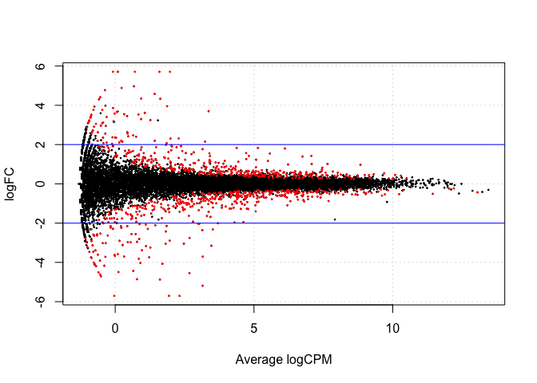
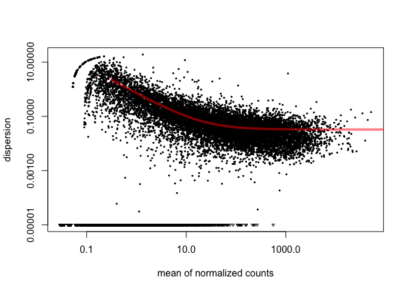
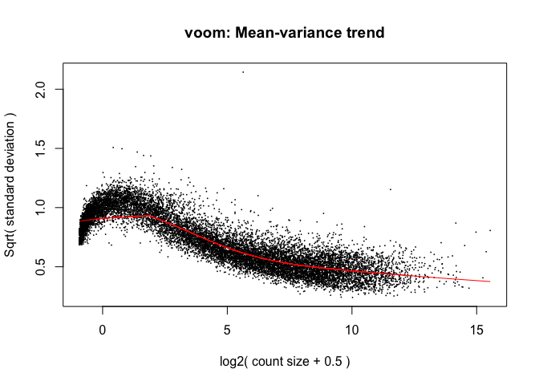

RNA-seq - Differential Expression Analysis
==========================================

Contributors: Katayoon Kasaian

## Introduction

In this seminar we will use a table of read counts for genomic features, such as genes or exons, derived from RNA-seq alignment BAM file to perform differential expression analysis. We will use edgeR, DESeq and voom + limma packages for this purpose. We will use the data from this [publication](http://www.ncbi.nlm.nih.gov/pubmed?term=21455293). The mRNA from 21 mice belonging to two different strains have been sequenced; the count table lists the number of reads aligned to the annotated mouse genes in the Ensembl database. Our goal is to identify those genes that are differentially expressed between the two strains.

* [Data file](https://github.com/STAT540-UBC/STAT540-UBC.github.io/tree/master/examples/bottomly/data/bottomly_count_table.tsv)
* [Design file](https://github.com/STAT540-UBC/STAT540-UBC.github.io/tree/master/examples/bottomly/data/bottomly_phenodata.tsv)

## Preliminaries

If you already haven't done so, please install the edgeR package from Bioconductor.


```r
source("http://bioconductor.org/biocLite.R")
biocLite("edgeR")
```


```r
library(edgeR)
```

```r
# You can access the edgeR User's Guide:
edgeRUsersGuide()
```
or [the reference manual](http://www.bioconductor.org/packages/2.11/bioc/manuals/edgeR/man/edgeR.pdf).

## edgeR

edgeR implements statistical methods based on the negative binomial distribution for count data. The first version of edgeR implemented exact statistical methods for comparison of multiple groups but is only applicable to experiments with one factor. This sometimes is referred to as classic edgeR. An addition to the classic version is an implementation of generalized linear models (glms) used for analysis of multifactor experiments where the response variables might not follow normal distribution. This sometimes is referred to as glm edgeR. Similar to limma, both versions of edgeR use empirical Bayes methods to estimate gene-specific variation. The classic edgeR uses quantile-adjusted conditional maximum likelihood (qCML) to estimate the disperison while the glm edgeR uses Cox-Reid profile-adjusted likelihood (CR) for dispersion estimation.

edgeR takes in as an argument a table of integer counts, with rows corresponding to genes and columns to samples.

> Remember you may need to edit the file paths below, to reflect your working directory and local file storage choices.


```r
dat <- read.table("bottomly/data/bottomly_count_table.tsv",
                  header = TRUE, row.names = 1)
des <- read.table("bottomly/data/bottomly_phenodata.tsv",
                  header = TRUE, row.names = 1)
str(dat)
```

```
## 'data.frame':	36536 obs. of  21 variables:
##  $ SRX033480: int  369 0 0 0 0 0 21 15 517 0 ...
##  $ SRX033488: int  744 0 1 0 1 1 46 43 874 0 ...
##  $ SRX033481: int  287 0 0 0 1 0 20 12 340 0 ...
##  $ SRX033489: int  769 0 1 0 5 1 36 34 813 0 ...
##  $ SRX033482: int  348 0 1 0 0 0 12 14 378 0 ...
##  $ SRX033490: int  803 0 1 0 4 0 55 32 860 0 ...
##  $ SRX033483: int  433 0 0 0 0 0 27 19 528 0 ...
##  $ SRX033476: int  469 0 7 0 0 0 44 18 401 0 ...
##  $ SRX033478: int  585 0 6 0 0 0 32 44 584 0 ...
##  $ SRX033479: int  321 0 1 0 0 0 47 22 401 0 ...
##  $ SRX033472: int  301 0 1 0 4 0 40 17 331 0 ...
##  $ SRX033473: int  461 0 1 0 1 0 40 24 431 0 ...
##  $ SRX033474: int  309 0 1 0 1 0 30 29 341 0 ...
##  $ SRX033475: int  374 0 1 0 0 0 27 15 480 0 ...
##  $ SRX033491: int  781 0 1 0 1 0 46 34 930 0 ...
##  $ SRX033484: int  555 0 2 0 2 0 28 23 585 0 ...
##  $ SRX033492: int  820 0 1 0 1 0 40 38 1137 0 ...
##  $ SRX033485: int  294 0 1 0 1 0 21 17 490 0 ...
##  $ SRX033493: int  758 0 4 0 1 0 52 29 1079 0 ...
##  $ SRX033486: int  419 0 1 0 1 0 27 12 565 0 ...
##  $ SRX033494: int  857 0 5 0 2 0 45 28 726 0 ...
```

```r
show(des)
```

```
##           num.tech.reps   strain experiment.number lane.number
## SRX033480             1 C57BL/6J                 6           1
## SRX033488             1 C57BL/6J                 7           1
## SRX033481             1 C57BL/6J                 6           2
## SRX033489             1 C57BL/6J                 7           2
## SRX033482             1 C57BL/6J                 6           3
## SRX033490             1 C57BL/6J                 7           3
## SRX033483             1 C57BL/6J                 6           5
## SRX033476             1 C57BL/6J                 4           6
## SRX033478             1 C57BL/6J                 4           7
## SRX033479             1 C57BL/6J                 4           8
## SRX033472             1   DBA/2J                 4           1
## SRX033473             1   DBA/2J                 4           2
## SRX033474             1   DBA/2J                 4           3
## SRX033475             1   DBA/2J                 4           5
## SRX033491             1   DBA/2J                 7           5
## SRX033484             1   DBA/2J                 6           6
## SRX033492             1   DBA/2J                 7           6
## SRX033485             1   DBA/2J                 6           7
## SRX033493             1   DBA/2J                 7           7
## SRX033486             1   DBA/2J                 6           8
## SRX033494             1   DBA/2J                 7           8
```

```r
all(rownames(des) == colnames(dat))
```

```
## [1] TRUE
```

### GLM edgeR

GLM approach allows for comparison of multiple groups and/or factor levels. A design matrix can be created in the same way done for limma. Similarly, contrasts matrices can be used to make comparisons. Most of the glm functions have similar names to the classic version with an addition of 'glm'.

The first step is to create a 'group' object describing which group each sample belongs to:

```r
with(des,table(strain))
```

```
## strain
## C57BL/6J   DBA/2J 
##       10       11
```

```r
group <- factor(c(rep("1",10),rep("2",11)))
group
```

```
##  [1] 1 1 1 1 1 1 1 1 1 1 2 2 2 2 2 2 2 2 2 2 2
## Levels: 1 2
```

```r
#this produces an object of type DGEList with can be manipulated in a similar way to any other list object in R
dge.glm <- DGEList(counts=dat, group=group)
str(dge.glm)
```

```
## Formal class 'DGEList' [package "edgeR"] with 1 slot
##   ..@ .Data:List of 2
##   .. ..$ : int [1:36536, 1:21] 369 0 0 0 0 0 21 15 517 0 ...
##   .. .. ..- attr(*, "dimnames")=List of 2
##   .. .. .. ..$ : chr [1:36536] "ENSMUSG00000000001" "ENSMUSG00000000003" "ENSMUSG00000000028" "ENSMUSG00000000031" ...
##   .. .. .. ..$ : chr [1:21] "SRX033480" "SRX033488" "SRX033481" "SRX033489" ...
##   .. ..$ :'data.frame':	21 obs. of  3 variables:
##   .. .. ..$ group       : Factor w/ 2 levels "1","2": 1 1 1 1 1 1 1 1 1 1 ...
##   .. .. ..$ lib.size    : num [1:21] 3040296 6303665 2717092 6545795 3016179 ...
##   .. .. ..$ norm.factors: num [1:21] 1 1 1 1 1 1 1 1 1 1 ...
```

```r
names(dge.glm)
```

```
## [1] "counts"  "samples"
```

```r
dge.glm[["samples"]]
```

```
##           group lib.size norm.factors
## SRX033480     1  3040296            1
## SRX033488     1  6303665            1
## SRX033481     1  2717092            1
## SRX033489     1  6545795            1
## SRX033482     1  3016179            1
## SRX033490     1  7097379            1
## SRX033483     1  3707895            1
## SRX033476     1  5165144            1
## SRX033478     1  4953201            1
## SRX033479     1  4192872            1
## SRX033472     2  3970729            1
## SRX033473     2  4733003            1
## SRX033474     2  3702051            1
## SRX033475     2  3569483            1
## SRX033491     2  7276198            1
## SRX033484     2  4422272            1
## SRX033492     2  7115851            1
## SRX033485     2  3467730            1
## SRX033493     2  7339817            1
## SRX033486     2  3879114            1
## SRX033494     2  6771680            1
```

```r
nrow(dge.glm[[1]])
```

```
## [1] 36536
```

```r
ncol(dge.glm[[1]])
```

```
## [1] 21
```

This DGELIst object has two components, one is a matrix call 'counts' storing the count data and the other is a data.frame called 'samples' storing information for samples. Optionally, you can also provide an annotation file for the genes which will be stored in the data.frame 'genes'. The data.frame 'samples', contains the samples IDs, group information and library sizes (or equally library sequence depth). You can either supply the library size info or it can be calculated from the sums of counts in each column.


```r
design <- model.matrix(~group)
design
```

```
##    (Intercept) group2
## 1            1      0
## 2            1      0
## 3            1      0
## 4            1      0
## 5            1      0
## 6            1      0
## 7            1      0
## 8            1      0
## 9            1      0
## 10           1      0
## 11           1      1
## 12           1      1
## 13           1      1
## 14           1      1
## 15           1      1
## 16           1      1
## 17           1      1
## 18           1      1
## 19           1      1
## 20           1      1
## 21           1      1
## attr(,"assign")
## [1] 0 1
## attr(,"contrasts")
## attr(,"contrasts")$group
## [1] "contr.treatment"
```

```r
dge.glm.com.disp <- estimateGLMCommonDisp(dge.glm,design, verbose=TRUE)
```

```
## Disp = 0.03893 , BCV = 0.1973
```

```r
dge.glm.trend.disp <- estimateGLMTrendedDisp(dge.glm.com.disp, design)
```

```
## Loading required package: splines
```

```r
dge.glm.tag.disp <- estimateGLMTagwiseDisp(dge.glm.trend.disp, design)
#plot the tagwise dispersion against log2-CPM (counts per million)
plotBCV(dge.glm.tag.disp)
```

 


```r
fit <- glmFit(dge.glm.tag.disp,design)
colnames(coef(fit))
```

```
## [1] "(Intercept)" "group2"
```

```r
lrt <- glmLRT(fit,coef=2)
topTags(lrt)
```

```
## Coefficient:  group2 
##                        logFC   logCPM       LR       PValue          FDR
## ENSMUSG00000020912 -5.187289 3.154742 401.7945 2.240262e-89 8.185020e-85
## ENSMUSG00000050141 -5.362823 2.318978 311.6014 9.780888e-70 1.786773e-65
## ENSMUSG00000035775 -4.543122 2.673605 297.9870 9.043434e-67 1.101370e-62
## ENSMUSG00000015484 -1.967808 4.306653 282.5253 2.114898e-63 1.931748e-59
## ENSMUSG00000024248 -3.152197 3.463418 277.0265 3.338841e-62 2.439758e-58
## ENSMUSG00000030532  1.546752 5.571837 269.3588 1.565543e-60 9.533111e-57
## ENSMUSG00000054354 -6.282536 1.939750 249.3194 3.654496e-56 1.907438e-52
## ENSMUSG00000023236  1.426014 7.066959 245.0380 3.135006e-55 1.431757e-51
## ENSMUSG00000050824  3.704800 3.364547 229.6505 7.104807e-52 2.884236e-48
## ENSMUSG00000015852 -2.361550 3.138220 214.8359 1.210221e-48 4.047419e-45
```

```r
tt.glm <- topTags(lrt, n=Inf)
class(tt.glm)
```

```
## [1] "TopTags"
## attr(,"package")
## [1] "edgeR"
```

```r
nrow(tt.glm$table[tt.glm$table$FDR < 0.01,])
```

```
## [1] 600
```

```r
interestingSamples <- rownames(tt.glm$table[tt.glm$table$FDR < 1e-50,])
cpm(dge.glm.tag.disp)[interestingSamples,]
```

```
##                    SRX033480 SRX033488 SRX033481 SRX033489 SRX033482
## ENSMUSG00000020912  20.39275 12.691030  15.82574 14.818674 19.229628
## ENSMUSG00000050141  14.14336 10.152824  10.67318  6.263563  9.946359
## ENSMUSG00000035775  14.47228 10.628737  19.50615 11.304968 12.930267
## ENSMUSG00000015484  26.97106 33.948505  32.75561 36.206450 31.496804
## ENSMUSG00000024248  14.80119 26.016611  17.29791 23.526554 18.566537
## ENSMUSG00000030532  27.95780 24.906146  21.34635 25.359792 18.566537
## ENSMUSG00000054354  10.85421  7.614618  11.40926  8.707880  8.288633
## ENSMUSG00000023236  65.45415 78.684384  72.50399 72.412900 76.586966
##                    SRX033490 SRX033483 SRX033476 SRX033478 SRX033479
## ENSMUSG00000020912 17.330341 26.430090 13.358776 23.621089   14.3100
## ENSMUSG00000050141  7.890237  8.360539  6.582585 11.911489   12.4020
## ENSMUSG00000035775 12.539840 12.136266  6.388980 13.526606   11.2095
## ENSMUSG00000015484 33.392609 30.745207 34.655375 26.851323   31.4820
## ENSMUSG00000024248 25.784166 18.878636 24.781497 14.334165   14.3100
## ENSMUSG00000030532 26.770446 26.430090 19.166939 23.217309   20.0340
## ENSMUSG00000054354  7.608442  7.012065  3.291293  4.441572    5.9625
## ENSMUSG00000023236 80.874926 83.335693 55.177552 57.740439   66.3030
##                      SRX033472   SRX033473   SRX033474   SRX033475
## ENSMUSG00000020912   0.5036858   0.4225647   1.0804821   0.2801526
## ENSMUSG00000050141   0.2518429   0.0000000   0.0000000   0.2801526
## ENSMUSG00000035775   0.7555288   0.0000000   0.2701205   0.2801526
## ENSMUSG00000015484   7.0516019   4.8594941   9.1840982   7.8442732
## ENSMUSG00000024248   2.2665863   1.2676941   1.8908438   3.3618314
## ENSMUSG00000030532  69.7604898  70.5683052  63.2082054  63.0343386
## ENSMUSG00000054354   0.0000000   0.0000000   0.0000000   0.0000000
## ENSMUSG00000023236 195.4301087 183.6043628 176.1185894 156.3251597
##                      SRX033491   SRX033484   SRX033492   SRX033485
## ENSMUSG00000020912   1.0994753   0.0000000   0.7026566   0.8651193
## ENSMUSG00000050141   0.8246065   0.0000000   0.1405313   0.0000000
## ENSMUSG00000035775   0.6871721   0.6783843   0.1405313   0.5767462
## ENSMUSG00000015484   8.5209336   9.4973805   8.4318798   8.9395657
## ENSMUSG00000024248   3.1609915   1.5828968   1.6863760   1.7302385
## ENSMUSG00000030532  73.8022797  70.0997135  70.6872586  62.5769596
## ENSMUSG00000054354   0.5497377   0.0000000   0.0000000   0.0000000
## ENSMUSG00000023236 206.9762258 177.9628209 192.8089838 207.0518754
##                      SRX033493   SRX033486   SRX033494
## ENSMUSG00000020912   0.1362432   0.0000000   0.0000000
## ENSMUSG00000050141   0.1362432   0.2577908   0.1476738
## ENSMUSG00000035775   0.1362432   1.8045358   0.5906954
## ENSMUSG00000015484   6.6759158  10.3116330   8.8604305
## ENSMUSG00000024248   1.7711613   2.5779083   3.1011507
## ENSMUSG00000030532  78.6123142  59.2918898  71.3264655
## ENSMUSG00000054354   0.0000000   0.0000000   0.0000000
## ENSMUSG00000023236 201.6399046 204.6859154 192.7143633
```

```r
summary(de.glm <- decideTestsDGE(lrt, p=0.05, adjust="BH"))
```

```
##    [,1] 
## -1   451
## 0  35660
## 1    425
```

451 genes are under-expressed in group 2 (DBA/2J) compared with group 1 (C57BL/6J), 35660 show no differences in expression while 425 genes are over-expressed.


```r
#plotting the tagwise log fold changes against log-cpm
tags.glm <- rownames(dge.glm.tag.disp)[as.logical(de.glm)]
plotSmear(lrt, de.tags=tags.glm)
abline(h=c(-2,2),col="blue")
```

 

#### Mini exercise:

Redo the above analysis but first filter the data and remove any gene that has:
1. count equal to zero across all samples
2. count equal to zero in at least one sample in each genotype group


## DESeq

We will try the differential expression analysis of the same dataset using DESeq.


```r
source("http://www.bioconductor.org/biocLite.R")
biocLite("DESeq")
```


```r
library(DESeq)
#reading in the same count table data and grouping information
deSeqDat <- newCountDataSet(dat, group)
head(counts(deSeqDat))
```

```
##                    SRX033480 SRX033488 SRX033481 SRX033489 SRX033482
## ENSMUSG00000000001       369       744       287       769       348
## ENSMUSG00000000003         0         0         0         0         0
## ENSMUSG00000000028         0         1         0         1         1
## ENSMUSG00000000031         0         0         0         0         0
## ENSMUSG00000000037         0         1         1         5         0
## ENSMUSG00000000049         0         1         0         1         0
##                    SRX033490 SRX033483 SRX033476 SRX033478 SRX033479
## ENSMUSG00000000001       803       433       469       585       321
## ENSMUSG00000000003         0         0         0         0         0
## ENSMUSG00000000028         1         0         7         6         1
## ENSMUSG00000000031         0         0         0         0         0
## ENSMUSG00000000037         4         0         0         0         0
## ENSMUSG00000000049         0         0         0         0         0
##                    SRX033472 SRX033473 SRX033474 SRX033475 SRX033491
## ENSMUSG00000000001       301       461       309       374       781
## ENSMUSG00000000003         0         0         0         0         0
## ENSMUSG00000000028         1         1         1         1         1
## ENSMUSG00000000031         0         0         0         0         0
## ENSMUSG00000000037         4         1         1         0         1
## ENSMUSG00000000049         0         0         0         0         0
##                    SRX033484 SRX033492 SRX033485 SRX033493 SRX033486
## ENSMUSG00000000001       555       820       294       758       419
## ENSMUSG00000000003         0         0         0         0         0
## ENSMUSG00000000028         2         1         1         4         1
## ENSMUSG00000000031         0         0         0         0         0
## ENSMUSG00000000037         2         1         1         1         1
## ENSMUSG00000000049         0         0         0         0         0
##                    SRX033494
## ENSMUSG00000000001       857
## ENSMUSG00000000003         0
## ENSMUSG00000000028         5
## ENSMUSG00000000031         0
## ENSMUSG00000000037         2
## ENSMUSG00000000049         0
```

Next, we estimate the size factors to account for differences in library coverage and estimate the variance:

```r
deSeqDat <- estimateSizeFactors(deSeqDat)
sizeFactors(deSeqDat)
```

```
## SRX033480 SRX033488 SRX033481 SRX033489 SRX033482 SRX033490 SRX033483 
## 0.6439291 1.3453539 0.5784839 1.4295303 0.6355123 1.5239501 0.7933382 
## SRX033476 SRX033478 SRX033479 SRX033472 SRX033473 SRX033474 SRX033475 
## 1.1271894 1.0772279 0.8984474 0.8886335 1.0255149 0.7987292 0.7795619 
## SRX033491 SRX033484 SRX033492 SRX033485 SRX033493 SRX033486 SRX033494 
## 1.6161933 0.9881892 1.5720164 0.7557824 1.5922159 0.8264069 1.4715139
```

```r
deSeqDat <- estimateDispersions(deSeqDat)
#plotting the estimated dispersions against the mean normalized counts
plotDispEsts(deSeqDat)
```

 

Next, we will fit the model and examine the results

```r
## this takes a minute or so for JB
results <- nbinomTest(deSeqDat, levels(group)[1], levels(group)[2])
str(results)
```

```
## 'data.frame':	36536 obs. of  8 variables:
##  $ id            : chr  "ENSMUSG00000000001" "ENSMUSG00000000003" "ENSMUSG00000000028" "ENSMUSG00000000031" ...
##  $ baseMean      : num  489.18 0 1.57 0 1.1 ...
##  $ baseMeanA     : num  509.685 0 1.657 0 0.859 ...
##  $ baseMeanB     : num  470.53 0 1.49 0 1.32 ...
##  $ foldChange    : num  0.923 NaN 0.898 NaN 1.537 ...
##  $ log2FoldChange: num  -0.115 NaN -0.156 NaN 0.62 ...
##  $ pval          : num  0.498 NA 0.829 NA 0.968 ...
##  $ padj          : num  1 NA 1 NA 1 ...
```

```r
plotMA(results)
```

 


## Voom & limma


```r
library(limma)
norm.factor <- calcNormFactors(dat)
dat.voomed <- voom(dat,design,plot=TRUE,lib.size=colSums(dat)*norm.factor)
```

 

```r
dat.voomed
```

```
## An object of class "EList"
## $E
##                    SRX033480 SRX033488 SRX033481 SRX033489 SRX033482
## ENSMUSG00000000001   6.94149  6.915573  6.720452  6.871306  6.859719
## ENSMUSG00000000003  -2.58794 -3.624555 -2.446967 -3.716472 -2.585296
## ENSMUSG00000000028  -2.58794 -2.039592 -2.446967 -2.131509 -1.000333
## ENSMUSG00000000031  -2.58794 -3.624555 -2.446967 -3.716472 -2.585296
## ENSMUSG00000000037  -2.58794 -2.039592 -0.862004 -0.257040 -2.585296
##                     SRX033490 SRX033483  SRX033476  SRX033478 SRX033479
## ENSMUSG00000000001  6.8446945  6.870020  6.4976875  6.8898925  6.279179
## ENSMUSG00000000003 -3.8054597 -2.889869 -3.3772938 -3.3036328 -3.049496
## ENSMUSG00000000028 -2.2204972 -2.889869  0.5295968  0.3968069 -1.464533
## ENSMUSG00000000031 -3.8054597 -2.889869 -3.3772938 -3.3036328 -3.049496
## ENSMUSG00000000037 -0.6355347 -2.889869 -3.3772938 -3.3036328 -3.049496
##                     SRX033472 SRX033473 SRX033474 SRX033475 SRX033491
## ENSMUSG00000000001  6.2110288  6.614596  6.396557  6.693426  6.737338
## ENSMUSG00000000003 -3.0249854 -3.235591 -2.877238 -2.855396 -3.872764
## ENSMUSG00000000028 -1.4400229 -1.650629 -1.292276 -1.270433 -2.287802
## ENSMUSG00000000031 -3.0249854 -3.235591 -2.877238 -2.855396 -3.872764
## ENSMUSG00000000037  0.1449396 -1.650629 -1.292276 -2.855396 -2.287802
##                    SRX033484 SRX033492 SRX033485  SRX033493 SRX033486
## ENSMUSG00000000001  6.915095  6.855029  6.374763  6.7180709  6.760096
## ENSMUSG00000000003 -3.202548 -3.825331 -2.827361 -3.8489345 -2.952431
## ENSMUSG00000000028 -0.880620 -2.240368 -1.242398 -0.6790095 -1.367469
## ENSMUSG00000000031 -3.202548 -3.825331 -2.827361 -3.8489345 -2.952431
## ENSMUSG00000000037 -0.880620 -2.240368 -1.242398 -2.2639720 -1.367469
##                     SRX033494
## ENSMUSG00000000001  7.0046088
## ENSMUSG00000000003 -3.7393841
## ENSMUSG00000000028 -0.2799525
## ENSMUSG00000000031 -3.7393841
## ENSMUSG00000000037 -1.4174560
## 36531 more rows ...
## 
## $weights
##           [,1]      [,2]      [,3]      [,4]      [,5]      [,6]      [,7]
## [1,] 15.907464 19.292601 15.442542 19.596885 15.898582 19.890710 16.894779
## [2,]  1.631947  1.547136  1.631947  1.531198  1.631947  1.516585  1.631947
## [3,]  1.469383  1.383025  1.487744  1.378436  1.469725  1.374007  1.436079
## [4,]  1.631947  1.547136  1.631947  1.531198  1.631947  1.516585  1.631947
## [5,]  1.557533  1.421283  1.585189  1.413735  1.558021  1.406926  1.506703
##           [,8]      [,9]     [,10]     [,11]     [,12]     [,13]     [,14]
## [1,] 18.481533 18.240341 17.413280 16.987897 17.669758 16.503476 16.431896
## [2,]  1.595358  1.611640  1.631947  1.631947  1.631947  1.631947  1.631947
## [3,]  1.397102  1.401943  1.421440  1.403476  1.390290  1.414546  1.416224
## [4,]  1.595358  1.611640  1.631947  1.631947  1.631947  1.631947  1.631947
## [5,]  1.444781  1.452747  1.483912  1.422907  1.406063  1.436557  1.438765
##          [,15]     [,16]     [,17]     [,18]     [,19]     [,20]     [,21]
## [1,] 19.759877 17.563652 19.602674 16.338884 19.681807 16.747823 19.317868
## [2,]  1.531454  1.631947  1.539318  1.631947  1.535398  1.631947  1.555018
## [3,]  1.353624  1.392156  1.357990  1.418508  1.355816  1.408785  1.363541
## [4,]  1.531454  1.631947  1.539318  1.631947  1.535398  1.631947  1.555018
## [5,]  1.370275  1.408585  1.372628  1.441606  1.371456  1.429337  1.376902
## 36531 more rows ...
## 
## $design
##   (Intercept) group2
## 1           1      0
## 2           1      0
## 3           1      0
## 4           1      0
## 5           1      0
## 16 more rows ...
## 
## $targets
## [1] 3006197 6166939 2726341 6572633 3000692
## 16 more rows ...
```

```r
fit <- lmFit(dat.voomed, design)
fit <- eBayes(fit)
topTable(fit, coef=colnames(coef(fit)))
```

```
##                    X.Intercept.       group2   AveExpr        F
## ENSMUSG00000025867    12.476885 -0.013979212 12.470754 154234.3
## ENSMUSG00000022892    12.267792 -0.086478630 12.222557 138459.1
## ENSMUSG00000037852    12.320531 -0.237470013 12.193809 134825.9
## ENSMUSG00000042700    10.715625 -0.048028657 10.691748 133972.9
## ENSMUSG00000029461    10.300390  0.020715251 10.311394 121795.4
## ENSMUSG00000020658     9.609842 -0.019628302  9.600971 119934.8
## ENSMUSG00000060261     9.469186 -0.015743153  9.461364 117841.3
## ENSMUSG00000032549    11.903563  0.003544538 11.904877 117324.1
## ENSMUSG00000024462    10.226672 -0.138928517 10.153262 116766.5
## ENSMUSG00000030102    12.085133 -0.026149495 12.072716 112154.7
##                         P.Value    adj.P.Val
## ENSMUSG00000025867 2.584343e-55 9.442156e-51
## ENSMUSG00000022892 1.102529e-54 1.568109e-50
## ENSMUSG00000037852 1.576371e-54 1.568109e-50
## ENSMUSG00000042700 1.716783e-54 1.568109e-50
## ENSMUSG00000029461 6.182371e-54 4.424342e-50
## ENSMUSG00000020658 7.604037e-54 4.424342e-50
## ENSMUSG00000060261 9.635377e-54 4.424342e-50
## ENSMUSG00000032549 1.022240e-53 4.424342e-50
## ENSMUSG00000024462 1.089859e-53 4.424342e-50
## ENSMUSG00000030102 1.873555e-53 6.417334e-50
```

```r
#The rest you know.....
```


## Take Home Problem

Choose a specific threshold for the adjusted p value, find the genes identified as differentially expressed using each of edgeR, DESeq and voom+limma. Compare the number of genes in these 3 lists, and draw a venn digram demonstrating the overlap (if any!).
