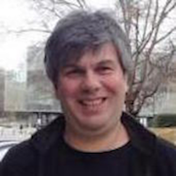
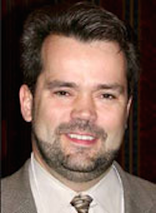
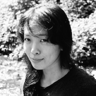
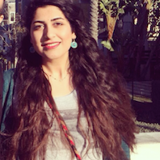

## Instructors

|  |   |  |
|---------------|---------------|---------------|
|  | |   |
|  Paul Pavlidis  | |  Amrit Singh      |
|  CHiBi and Psychiatry <paul@chibi.ubc.ca> | |  Pathology and Lab Medicine <Amrit.Singh@hli.ubc.ca> |
|  |  |  |
| Rob Balshaw |    | [Sara Mostafavi](http://www.stat.ubc.ca/~saram/) (on leave) |
|  Statistics <robert.balshaw@bccdc.ca> | |  Statistics and Medical Genetics <saram@cs.stanford.edu> |

## TAs

|  |  |  |
|---------------|---------------|---------------|
|  | |   |
|  Santina Lin  | |  Faurush Farhadi      |
|  <hello@santina.me> | |  <farnush.farhadi@gmail.com> |

<!-- [Sara Mostafavi](http://www.stat.ubc.ca/~saram/), lead instructor

  * Statistics and Medical Genetics
  * <saram@cs.stanford.edu>
  
Paul Pavlidis, instructor
  
  * CHiBi and Psychiatry
  * <paul@chibi.ubc.ca>
  
Marjan Farahbod, TA

  * <marjan.farahbod@gmail.com>
  
Santina Lin, TA

  * <hello@santina.me> -->
